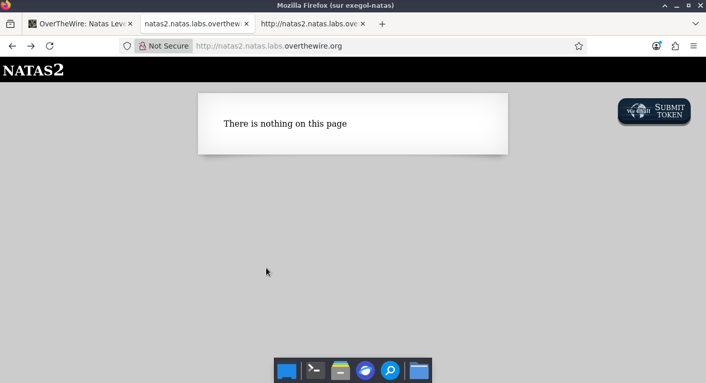
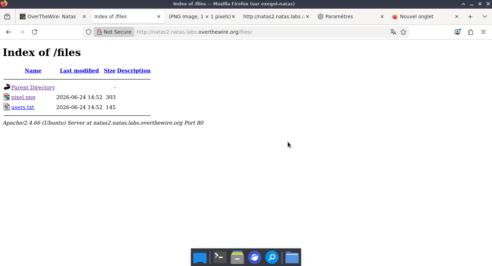
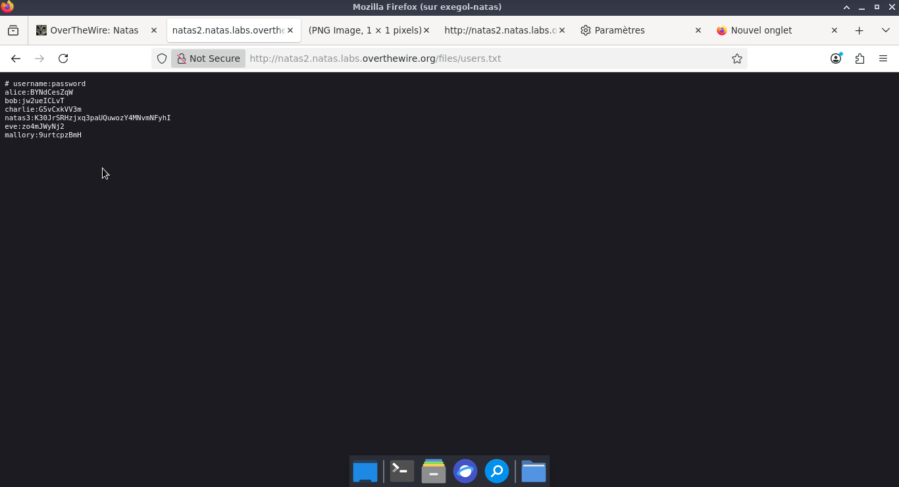

# OVERTHEWIRE NATAS

**OVERTHEWIRE** Natas 2  

**Category :**   web-security  

**Points :**  ✅  

**Status :** Résolu ✅

---

## 🎯 Challenge

- L'objectif de cette épreuve est de récupérer les identifiants requis pour s'authentifier au niveau supérieur de Natas.  
- 
---
## ⚡ Solution  
---
---
- 1 : L'analyse du code source révèle la présence d'une balise qui charge une image localement sur le serveur hôte via le chemin relatif suivant : 
- 2 : À présent, ajoutons le chemin /files/ à l'URL pour voir le contenu du dossier files/ .  
---

 
**Payload utilisé :**  

```http
http://natas2.natas.labs.overthewire.org/files/
```    


  


---
-  Action : Ouverture du fichier users.txt découvert dans le répertoire.  
- Objectif : Récupérer le mot de passe du niveau suivant.  
---  


**Réponse :**  

  


## 🚩 Flag
---
natas3:K30JrSRHzjxq3paUQuwozY4MNvmNFyhI   

---

## 🛡️ Remédiation   

-  Désactiver l'indexation des répertoires (Directory Listing) : La configuration du serveur web (comme Apache ou Nginx) doit être modifiée pour interdire l'affichage automatique du contenu des dossiers. Si aucun fichier index.html ou index.php n'est présent, le serveur doit renvoyer une erreur 403 Forbidden au lieu de lister les fichiers comme users.txt.


## 💡 Points Clés à Retenir  
- La faille : Exposition de fichiers sensibles due à une mauvaise configuration du serveur web.
- Le réflexe CTF : Toujours explorer l'arborescence des dossiers trouvés dans le code source (/files/, /images/, /js/). Un dossier mal sécurisé peut contenir des sauvegardes ou des identifiants oubliés.


---
*Malick Ramzy SOPODOU — OVERTHEWIRE 🌍*
