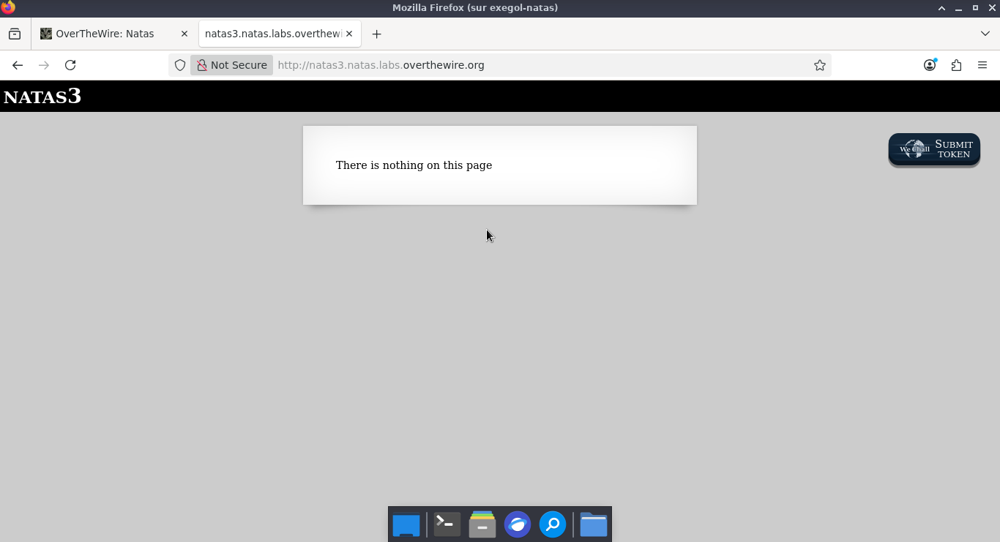
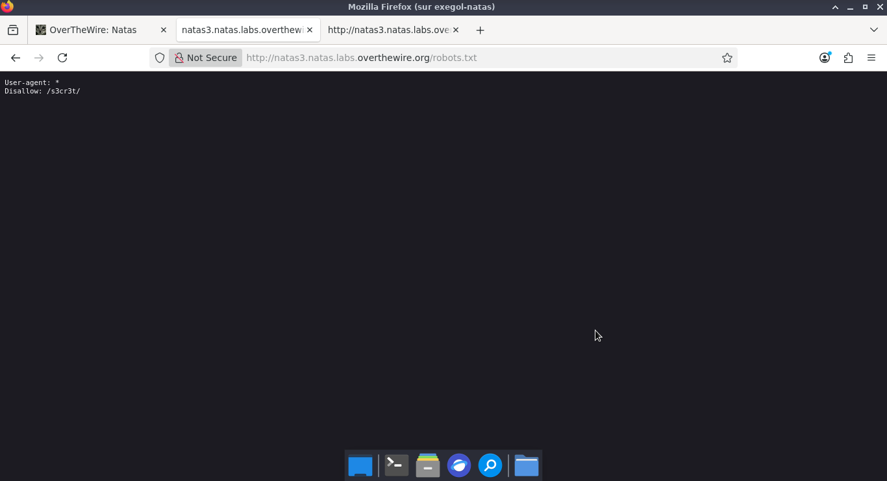
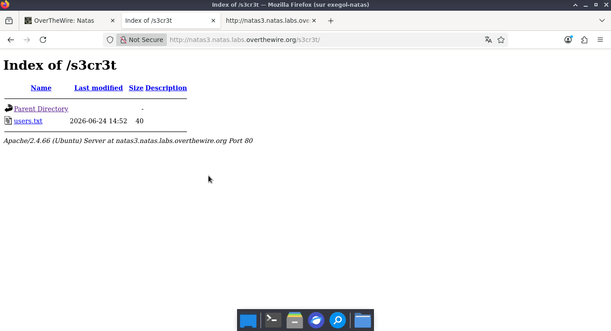
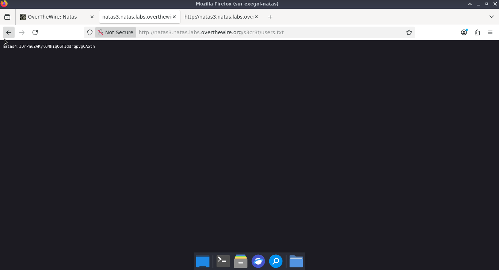

# OVERTHEWIRE

**OVERTHEWIRE** Natas  3  

**Category :** web-security   

**Points :**  ✅  

**Status :** Résolu ✅

---

## 🎯 Challenge
- L'objectif de cette épreuve est de récupérer les identifiants requis pour s'authentifier au niveau supérieur de Natas.
 
---
## ⚡ Solution  
-  Le code source de la page ne présentant aucune vulnérabilité apparente ni point d'entrée utilisateur, nous procédons à une phase de reconnaissance. Nous testons l'existence de répertoires ou de fichiers standards, tels que /admin ou /robots.txt, afin de vérifier si des ressources sensibles sont accessibles sur le serveur cible. 

---  
**Payload 1 :**  
- l'ajout de robots.txt
```http
http://natas3.natas.labs.overthewire.org/robots.txt
```  
  

- À présent, nous allons ajouter le chemin /s3cr3t/ trouvé dans le fichier robots.txt dans l'URL de Natas 3. 
**Payload 2 :**  

```http
http://natas3.natas.labs.overthewire.org/s3cr3t/
```  

  


---
- Action : Ouverture du fichier users.txt découvert dans le répertoire.  
- Objectif : Récupérer le mot de passe du niveau suivant.
---
**Réponse :**  

 


## 🚩 Flag
---
natas4:JDrPnuZAKyl6MkiqQGFIddrqpvgOASth

---

## 🛡️ Remédiation   

-  Ne pas utiliser robots.txt pour masquer des dossiers sensibles : Le fichier robots.txt est public et visible par tous. Il ne doit jamais servir à cacher des répertoires confidentiels comme /s3cr3t/ ou /admin. Pour sécuriser ces accès, il faut mettre en place une authentification stricte (comme un mot de passe) ou restreindre l'accès au niveau de la configuration du serveur web (en filtrant par adresse IP, par exemple


## 💡 Points Clés à Retenir  
---
- La faille : Sécurité par l'obscurité. Penser qu'un dossier est invisible simplement parce qu'il n'est pas lié sur la page d'accueil est une erreur de configuration majeure.
- Le réflexe CTF : Le fichier /robots.txt est une mine d'or. En tant qu'attaquant, les répertoires listés en Disallow: (interdits aux moteurs de recherche) sont précisément les premiers endroits qu'il faut aller explorer.
---


---
*Malick Ramzy SOPODOU — OVERTHEWIRE Natas 🌍*
