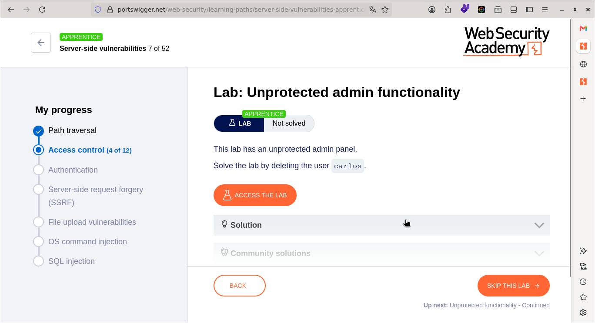
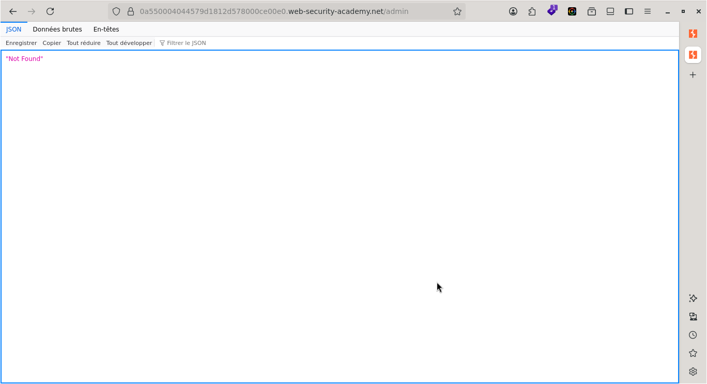
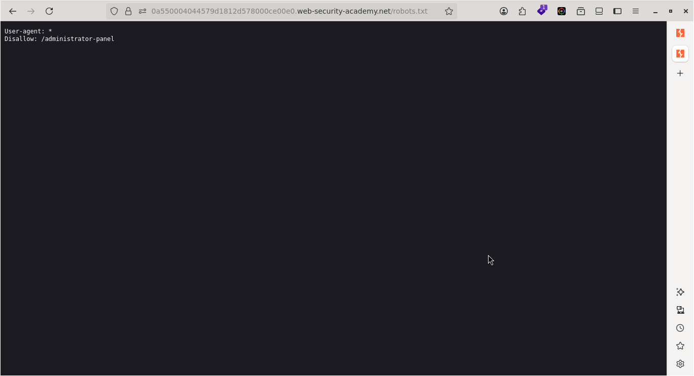
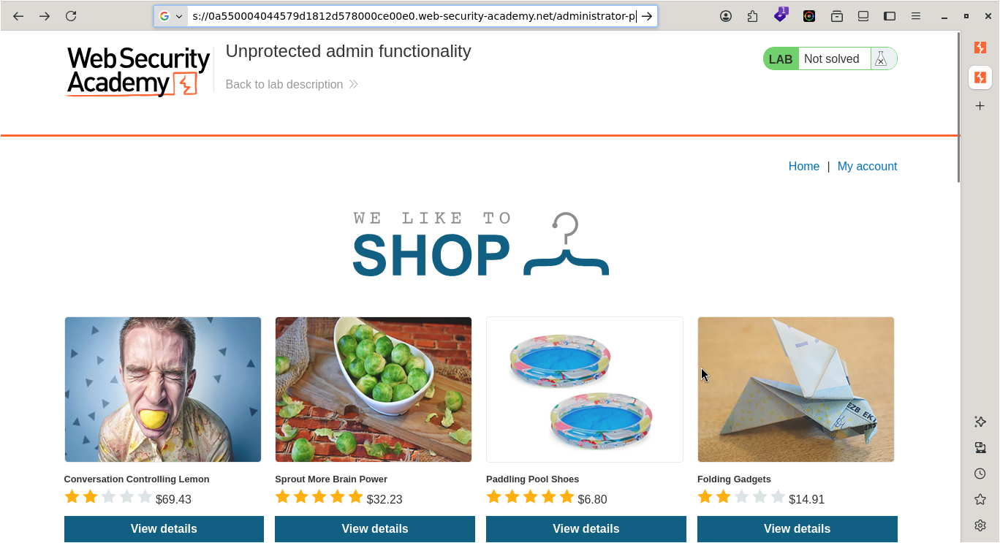
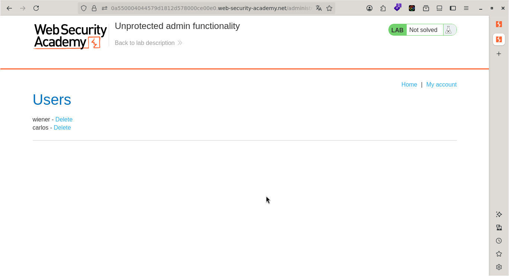
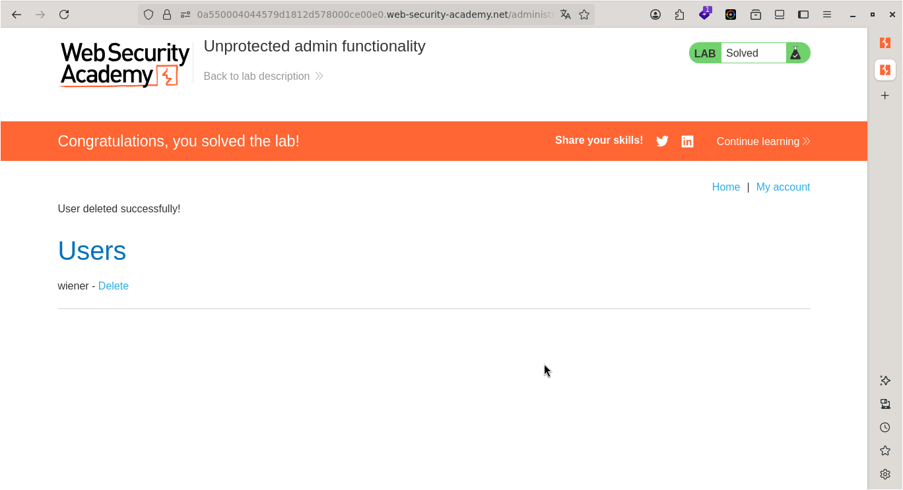

# Lab — Unprotected admin functionality

> **CTF :** PORTSWIGGER
> **Catégorie :** Access control
> **Difficulté :** APPRENTICE
> **Points :** ✅
> **Date :** <!-- JJ/MM/AAAA -->
> **Statut :** ✅ Résolu

---

## 📌 Description du Challenge

> *This lab has an unprotected admin panel.
Solve the lab by deleting the user carlos.*

---

## 🎯 Objectif

Nous devons supprimer l'utilisateur carlos.

---

## 🔍 Reconnaissance

- c'est une application qui propose des produits et possède un moyen de connexion.  


**Observations :**
- Étant donné que nous voulons supprimer un utilisateur, il nous faut alors les droits d'administrateur.
-

**Outils utilisés :**
- Firefox

---

## 🧠 Hypothèse

- Les constatations orientent les recherches vers une vulnérabilité de contrôle d'accès défaillant, caractérisée par le défaut de protection de l'interface d'administration.

---

## ⚔️ Exploitation

### Étape 1 — tester l'accès direct au répertoire /admin
- La première étape a consisté à tester l'accès direct au répertoire /admin via l'URL sous la forme https://[cible]/admin, afin de vérifier la présence d'une interface d'administration exposée. »- 

**Requête :**
```http
https://0a77003303b1d85a83f119d700a90046.web-security-academy.net/admin
``` 


**Réponse :**
```
"Not Found"
```  


---

### Étape 2 — analyser le fichier /robots.txt

- L'accès direct au répertoire /admin ayant échoué, l'étape suivante a consisté à analyser le fichier /robots.txt afin d'identifier d'éventuels répertoires ou fichiers masqués indexés par le serveur.

**Requête :**
```http
https://0a77003303b1d85a83f119d700a90046.web-security-academy.net/robots.txt
```  


**Réponse :**
```
User-agent: *
Disallow: /administrator-panel

```  


---

### Étape 3 — ajouter /administrator-panel


-  L'examen du fichier /robots.txt a mis en évidence la directive restrictive suivante :
textUser-agent: *
Disallow: /administrator-panel
- Nous allons donc ajouter /administrator-panel à l'URL du site web pour accéder à la page d'administration.


**Payload utilisé :**
```http
https://0a77003303b1d85a83f119d700a90046.web-security-academy.net/administrator-panel
```



**Résultat :**
```
 wiener - Delete
carlos - Delete 
```


- À présent, supprimons l'utilisateur Carlos.

---

## 🚩 Flag



---

## 🛡️ Remédiation

L'exposition d'un panneau d'administration via le fichier robots.txt relève d'un problème de sécurité par l'obscurité et d'un contrôle d'accès défaillant. Pour corriger cela, il faut appliquer les mesures suivantes :  
- Mettre en place une authentification forte : L'accès à la page /administrator-panel doit impérativement exiger une authentification (identifiant et mot de passe robuste), voire un deuxième facteur (MFA), avant de permettre la moindre action.  

- Restreindre les accès réseau : Idéalement, l'interface d'administration ne devrait pas être accessible depuis l'Internet public. Il est recommandé de limiter son accès aux seules adresses IP internes de l'entreprise ou via un VPN sécurisé.  

- Retirer le chemin du fichier robots.txt : Le fichier robots.txt est public. Y inscrire un dossier sensible pour empêcher les robots de l'indexer revient à donner une carte routière aux attaquants. Si la page est correctement protégée par une authentification, il n'est plus nécessaire de la masquer dans ce fichier.

---

## 💡 Points Clés à Retenir  

Cette phase du test d'intrusion met en lumière plusieurs principes de sécurité :

- L'obscurité n'est pas de la sécurité : Masquer un dossier ou un fichier ne suffit pas à le protéger. Tôt ou tard, un attaquant finira par découvrir le chemin (via du brute-force, des fuites d'informations ou en lisant simplement le fichier robots.txt).
- Le principe de défense en profondeur : Chaque fonctionnalité sensible (comme la suppression d'un utilisateur) doit posséder ses propres mécanismes de vérification de sécurité. Même si un utilisateur trouve une page cachée, le système doit rejeter l'action s'il n'a pas les droits d'administration validés côté serveur.
- La mauvaise utilisation des outils de configuration : Le fichier robots.txt est un outil de référencement pour les moteurs de recherche (comme Google), pas un outil de sécurité.

---

## 📚 Références

- [PortSwigger — Unprotected admin functionality](https://portswigger.net/web-security/topic)
- [OWASP — Vulnérabilité Associée](https://owasp.org/Top10/)


---

*Rédigé par : Malick Ramzy SOPODOU*  

*PORTSWIGGER 🌍*
