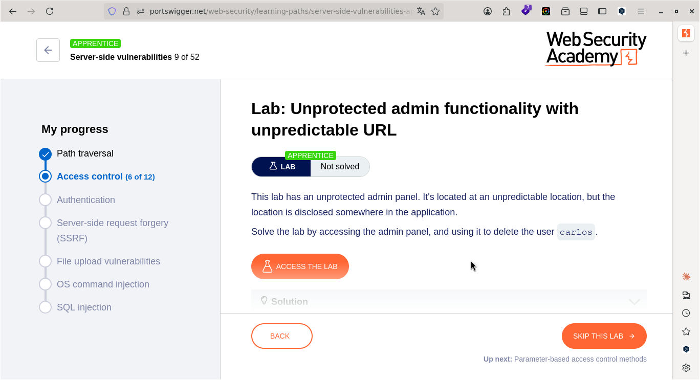
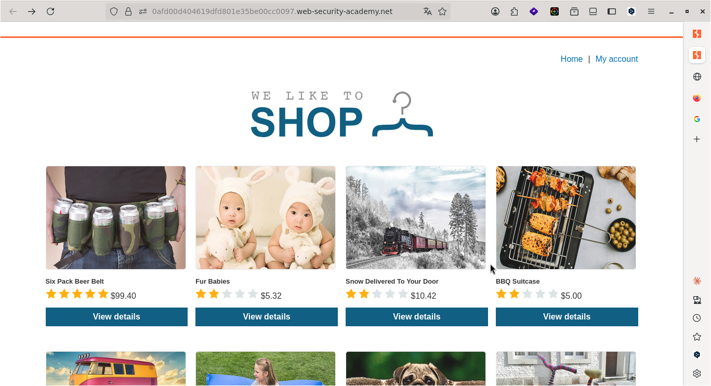
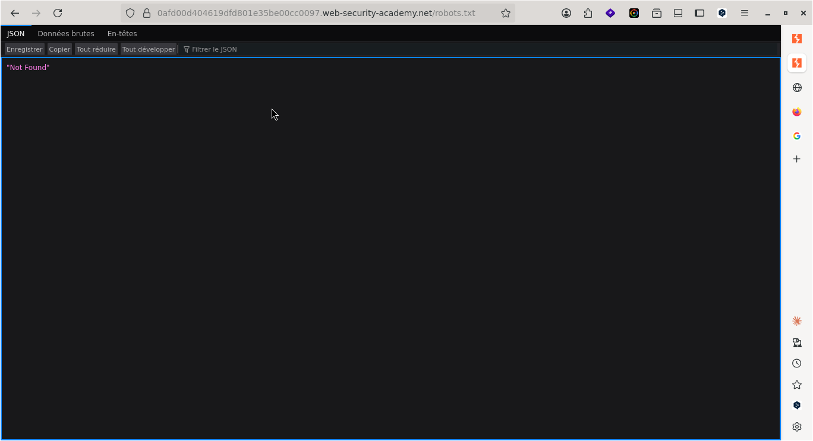
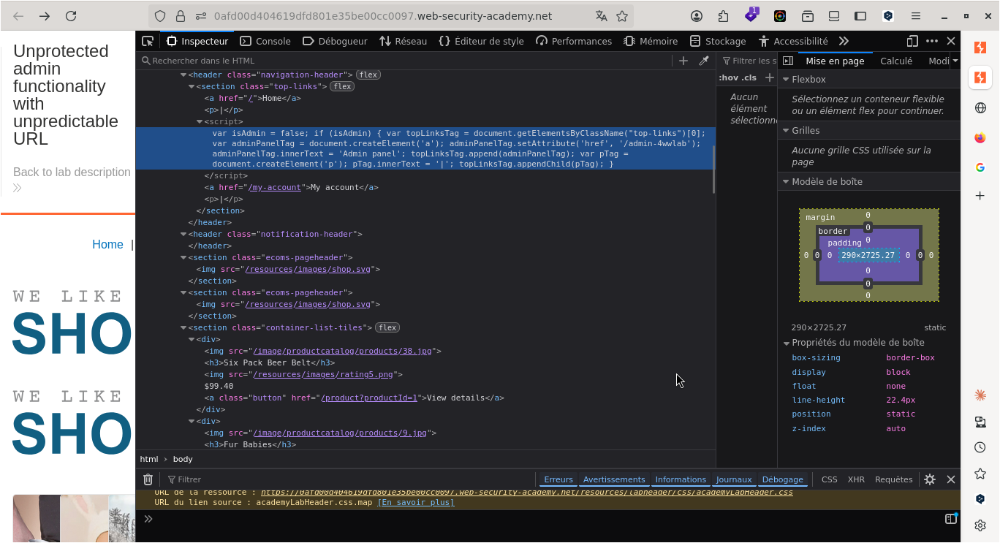
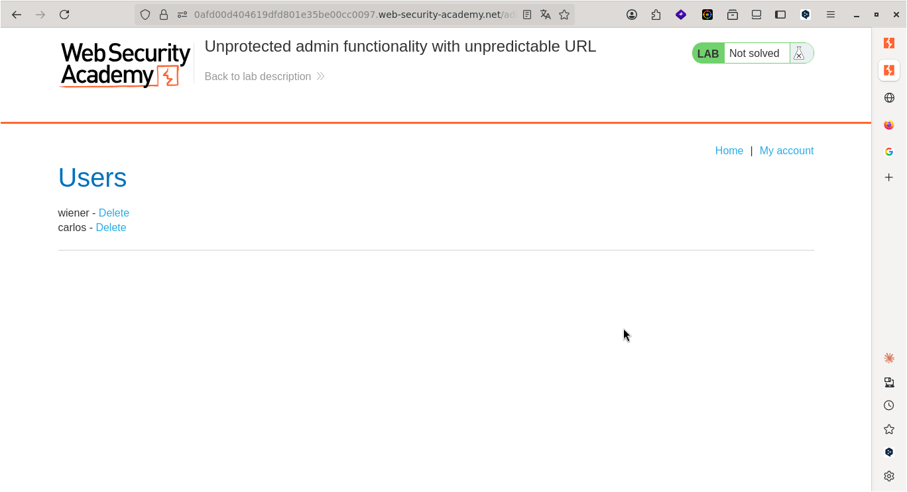
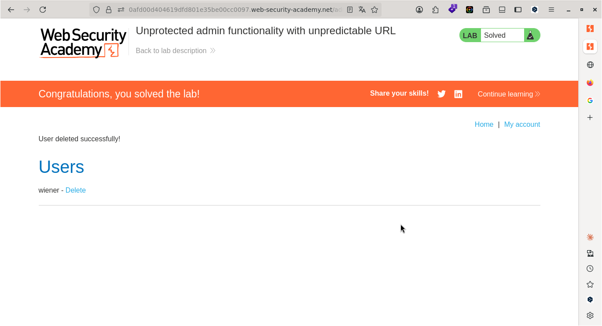

# Lab: Unprotected admin functionality with unpredictable URL

> **CTF :** PORTSWIGGER  

> **Catégorie :** Access control  

> **Difficulté :** APPRENTICE  

> **Points :** ✅  

> **Date :** 26/07/2026  

> **Statut :** ✅ Résolu

---

## 📌 Description du Challenge

> *This lab has an unprotected admin panel. It's located at an unpredictable location, but the location is disclosed somewhere in the application.
Solve the lab by accessing the admin panel, and using it to delete the user carlos.*

---

## 🎯 Objectif

- Nous devons accéder au panneau d'administration pour supprimer l'utilisateur carlos. 
---

## 🔍 Reconnaissance

- c'est une application qui propose des produits et possède un moyen de connexion.  


**Observations :**
- Étant donné que nous voulons supprimer un utilisateur, il nous faut alors les droits d'administrateur.
-

**Outils utilisés :**
- Firefox

---

## 🧠 Hypothèse

Les constatations orientent les recherches vers une vulnérabilité de contrôle d'accès défaillant, caractérisée par le défaut de protection de l'interface d'administration.

---

## ⚔️ Exploitation

### Étape 1 — tester l'accès direct au répertoire /admin  

- La première étape a consisté à tester l'accès direct au répertoire /admin via l'URL sous la forme https://[cible]/admin, afin de vérifier la présence d'une interface d'administration exposée. 


**Requête :**  


```http
https://0afd00d404619dfd801e35be00cc0097.web-security-academy.net/admin
```

**Réponse :**  

```
"Not Found"
```


---

### Étape 2 — analyser le fichier /robots.txt

- L'accès direct au répertoire /admin ayant échoué, l'étape suivante a consisté à analyser le fichier /robots.txt afin d'identifier d'éventuels répertoires ou fichiers masqués indexés par le serveur.

**Requête :**
```http
https://0afd00d404619dfd801e35be00cc0097.web-security-academy.net/robots.txt
```  


**Réponse :**
```
"Not Found"
```  


---

### Étape 3 — inspecter le code source HTML

- L'analyse du fichier /robots.txt n'ayant fourni aucun résultat exploitable, l'étape suivante a consisté à inspecter le code source HTML/JavaScript de la page afin d'y rechercher d'éventuelles informations sensibles laissées par les développeurs.



---  

-  L'inspection du code source HTML de l'application a mis en évidence l'existence d'un chemin d'accès masqué vers l'interface de gestion. L'emplacement exact de la page d'administration a ainsi été divulgué, révélant l'URL spécifique : /admin-4wwlab .  

- L'étape suivante consiste à naviguer vers l'URL ainsi découverte en insérant le chemin /admin-4wwlab à la suite du domaine principal, afin de forcer l'affichage de l'interface d'administration. 


**Payload utilisé :**
```
https://0afd00d404619dfd801e35be00cc0097.web-security-academy.net/admin-4wwlab
```

**Résultat :**
```
wiener - Delete
carlos - Delete 
```


---

## 🚩 Flag




---

## 🛡️ Remédiation

- Sécuriser l'accès à l'interface d'administration : Le fait de changer le nom d'un dossier par un nom complexe ou aléatoire (comme /admin-4wwlab) ne constitue pas une mesure de sécurité. On appelle cela de la sécurité par l'obscurité. La seule remédiation efficace consiste à exiger une authentification stricte (identifiant, mot de passe fort et idéalement un deuxième facteur MFA) avant d'autoriser l'accès à la page ou de permettre des actions critiques comme la suppression d'un compte.  

- Empêcher la divulgation d'informations (Information Disclosure) : Les développeurs doivent nettoyer le code source avant de déployer l'application en production. Les liens vers des interfaces sensibles, les scripts de test, les commentaires de développement (comme <!-- <a href="/admin-..."> -->) ou les anciennes variables de configuration doivent être systématiquement supprimés du code HTML/JavaScript envoyé au client.

---

## 💡 Points Clés à Retenir

Ce scénario est une excellente démonstration de la méthodologie d'un attaquant et enseigne plusieurs principes de défense :

- L'obscurité échouera toujours : Qu'il s'agisse de masquer un chemin dans un fichier robots.txt (qui est par nature public) ou de deviner un dossier "secret" dans le code source, un attaquant méthodique finit toujours par cartographier l'application. La sécurité doit reposer sur des contrôles d'accès solides, jamais sur le secret d'un chemin d'accès.  

- La reconnaissance est la clé : Un bon testeur d'intrusion (ou joueur de CTF) ne s'arrête pas au premier obstacle. Si une tentative échoue (comme l'accès direct à /admin ou l'examen du robots.txt), l'analyse minutieuse de chaque élément exposé (comme le code source HTML) permet souvent de découvrir le vecteur d'attaque manquant.   

---

## 📚 Références

- [PortSwigger — Lab: Unprotected admin functionality with unpredictable URL](https://portswigger.net/web-security/topic)
- [OWASP — Vulnérabilité Associée](https://owasp.org/Top10/)


---

*Rédigé par : Malick Ramzy SOPODOU*
*PORTSWIGGER🌍*
