# Lab: Username enumeration via different responses

> **CTF :** PORTSWIGGER  

> **Catégorie :** Authentication   

> **Difficulté :** APPRENTICE  

> **Points :**  ✅
> **Date :** 27/07/2026
> **Statut :** ✅ Résolu 
atut :**  ✅ Résolu 

---

## 📌 Description du Challenge

> *Ce laboratoire est vulnérable à l'énumération du nom d'utilisateur et aux attaques par mot de passe par force brute. Il a un compte avec un nom d'utilisateur et un mot de passe prévisibles, qui peut être trouvé dans les listes de mots suivantes:
 Noms d'utilisateurs candidats
 Mots de passe candidats
Pour résoudre le laboratoire, énumérez un nom d'utilisateur valide, forcez le mot de passe de cet utilisateur, puis accédez à la page de son compte.*

---

## 🎯 Objectif

Pour résoudre le laboratoire, nous devons énumérez un nom d'utilisateur valide, forcez le mot de passe de cet utilisateur et  accédez à la page de son compte. 

---

## 🔍 Reconnaissance

Le challenge nous a donné une liste de noms d'utilisateurs et une liste de mots de passe.
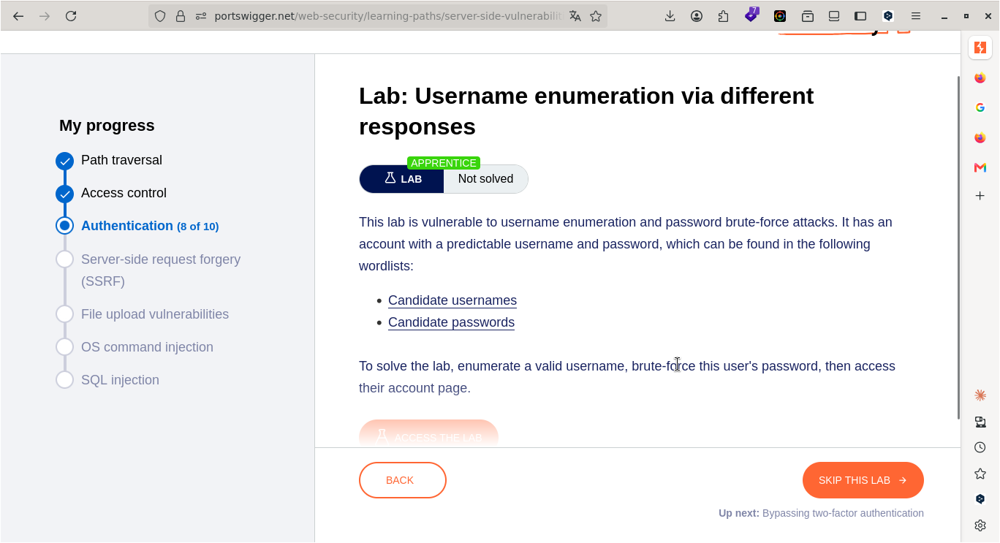

**Observations :**
-
-

**Outils utilisés :**
- Burp Suite

---

## 🧠 Hypothèse

Je pense à une vulnérabilité de type brute force (ou force brute).
---

## ⚔️ Exploitation

### Étape 1 — Comprendre le fonctionnement du site  

#### Naviguons vers l'onglet My Account et essayons de nous authentifier tout en interceptant les requêtes dans Burp Suite.  
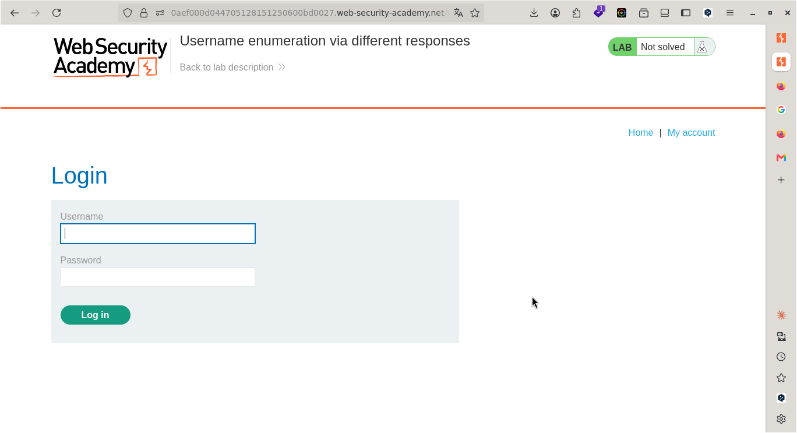

#### Entrons un nom d'utilisateur et un mot de passe au hasard pour capturer la requête issue de la tentative de connexion.

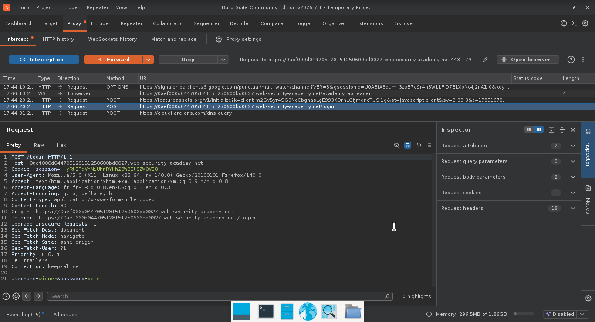

---

### Étape 2 — INTRUDER

Effectuez un clic droit sur la requête HTTP interceptée et sélectionnez Send to Intruder pour préparer l'attaque par dictionnaire.  
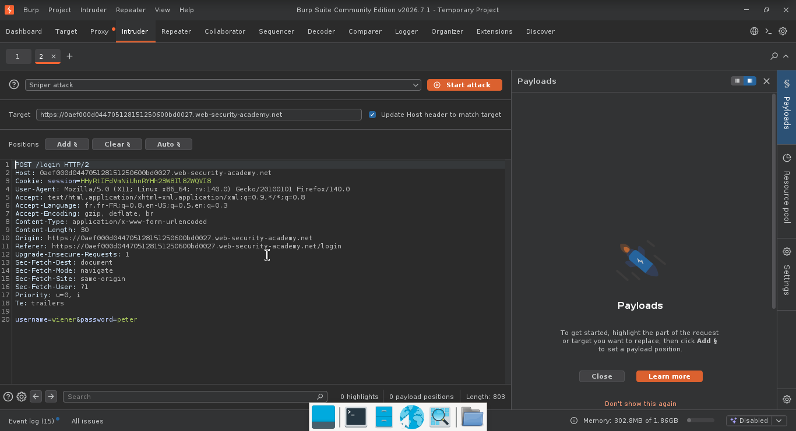

---

### Étape 3 — Brute force sur le username.  

- D'abord, sélectionnez la valeur du username et cliquez sur l'onglet add.

- Ensuite, sélectionnez « simple liste » dans le menu de droite.   
- Copiez toute la liste des usernames donnés par le challenge PortSwigger, allez dans Intruder, puis cliquez sur « Paste » dans le menu de droite pour coller la liste dans le champ libre.
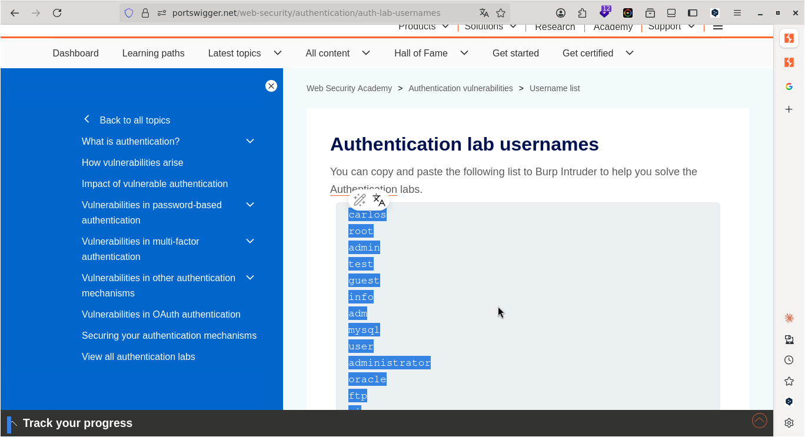
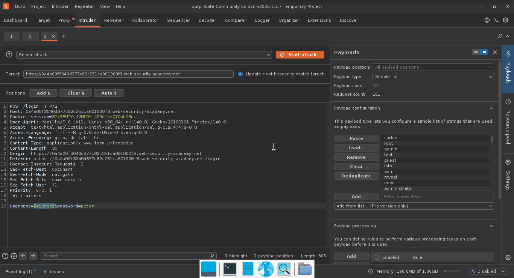
#### Cliquez sur « Start Attack »

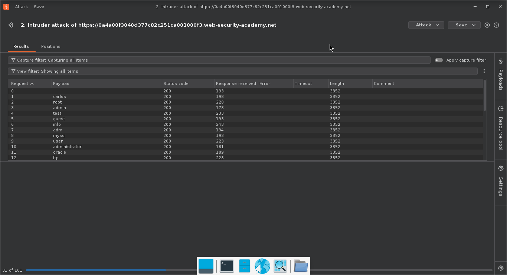

-  À présent, vérifiez la taille (Length) des différentes attaques ; vous en constaterez une qui est différente des autres.

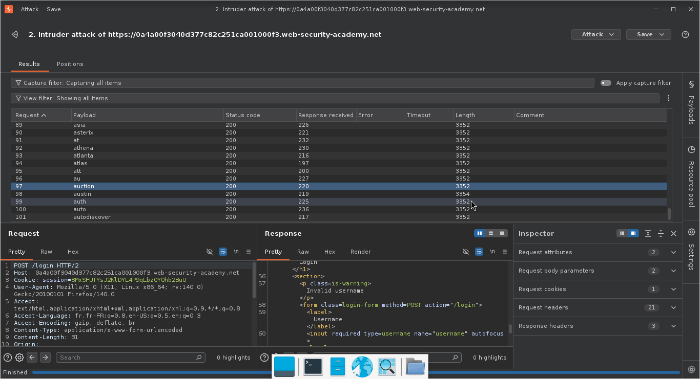

**En analysant la réponse HTTP des attaques ayant la même longueur, on remarque le message « Invalid Username ». En revanche, l'attaque avec une longueur distincte renvoie le message « Incorrect Password ». Nous en déduisons que le nom d'utilisateur valide est « austin »**  

#### Invalid Username.  

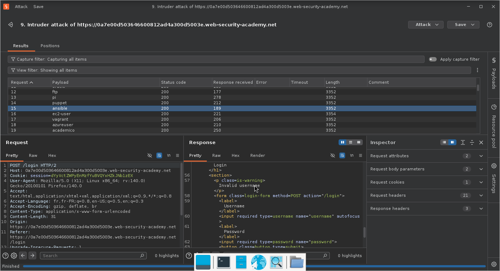  

#### Incorrect Password.  

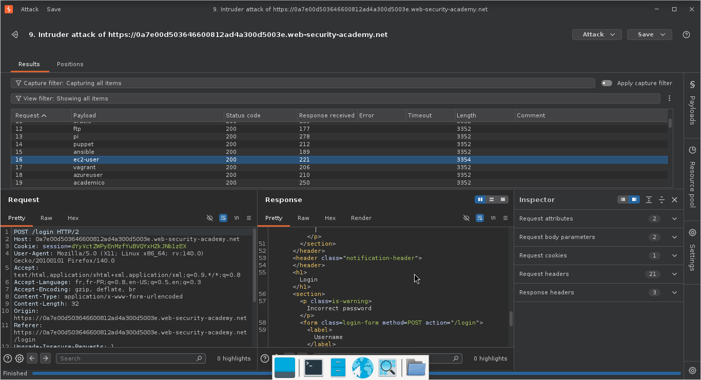  
  

### À présent, nous allons figer le nom d’utilisateur « ec2-user » et définir le champ du mot de passe comme position de payload, afin de lancer une nouvelle attaque Intruder en utilisant la liste de mots de passe fournie par le challenge.  

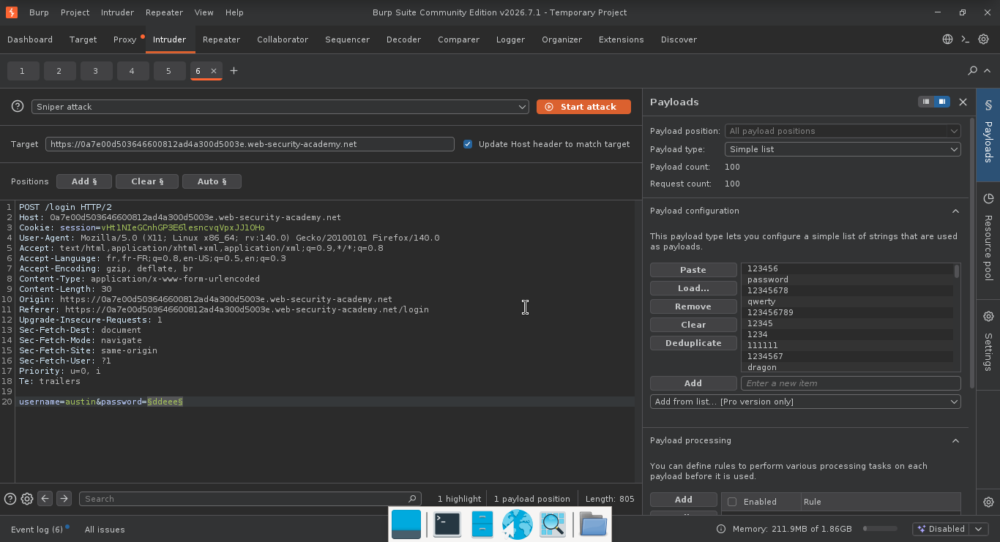

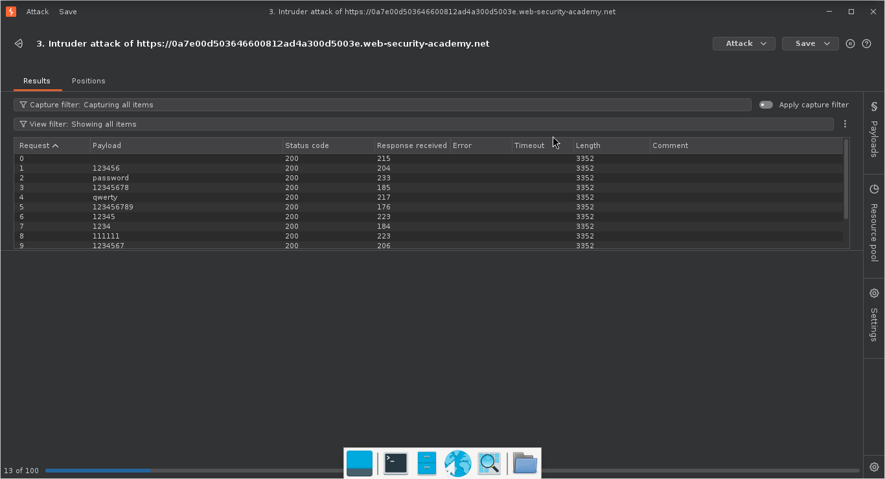
#### En analysant la colonne « Length » des requêtes, on remarque une valeur anormalement élevée. L'examen de son code source révèle un message confirmant la réussite de l'authentification.

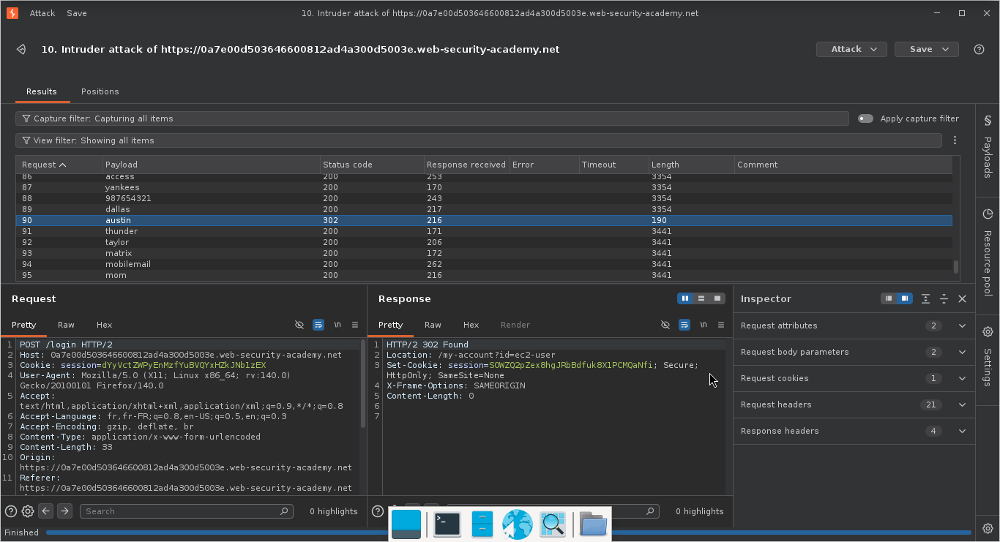

**Payload utilisé :**
```
username = ec2-user
password = austin
```

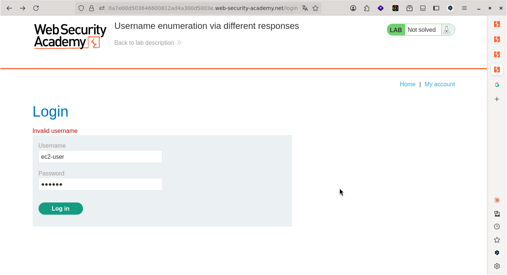
---

## 🚩 Flag

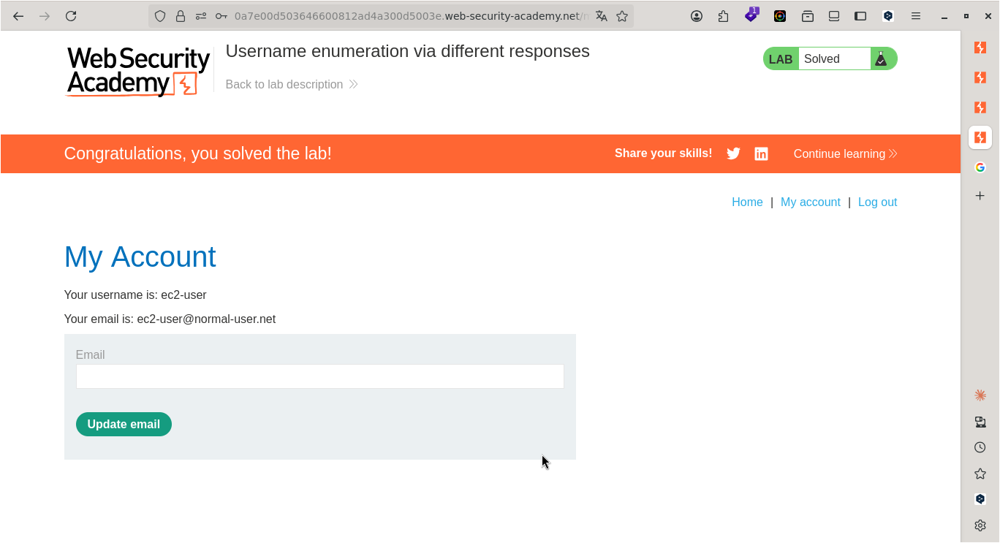

---

## 🛡️ Remédiation

Pour bloquer l'attaque que vous venez de réaliser, un administrateur système doit appliquer ces trois mesures :

- Généraliser les messages d'erreur : Ne jamais différencier « Invalid Username » et « Incorrect Password ». Il faut utiliser un message unique et générique, par exemple : « Identifiant ou mot de passe incorrect ». Cela empêche l'attaquant de savoir si le nom d'utilisateur existe.  
- Implémenter un mécanisme de verrouillage (Rate Limiting) : Bloquer temporairement un compte ou une adresse IP après plusieurs tentatives de connexion infructueuses (ex: 5 échecs). Cela rend l'attaque par force brute impossible ou extrêmement lente.  
- Ajouter un CAPTCHA : Déclencher un CAPTCHA après 3 tentatives infructueuses pour s'assurer qu'un humain est bien derrière l'écran, bloquant ainsi les outils automatisés comme Burp Suite Intruder.

---

## 💡 Points Clés à Retenir

Voici les concepts théoriques fondamentaux à retenir de ce TP :  
- L'énumération d'identifiants (User Enumeration) : C'est la première phase de l'attaque. Elle consiste à exploiter une fuite d'information (le message d'erreur ou le temps de réponse) pour valider l'existence d'un utilisateur.  
- L'importance de la colonne "Length" : En analyse de requêtes, un changement de taille (Length) ou de code statut HTTP (200 OK vs 403 Forbidden) indique une modification du comportement de l'application. C'est l'indicateur clé pour repérer une anomalie ou un succès.  
- La MFA (Authentification Multifacteur) : Même si un attaquant trouve le bon identifiant et le bon mot de passe via force brute, la MFA reste la barrière ultime pour l'empêcher d'accéder au compte.

---

## 📚 Références

- [PortSwigger — Lab: Username enumeration via different responses](https://portswigger.net/web-security/topic)
- [OWASP — Vulnérabilité Associée](https://owasp.org/Top10/)


---

*Rédigé par : Malick Ramzy SOPODOU*  

*PORTSWIGGER🌍*
