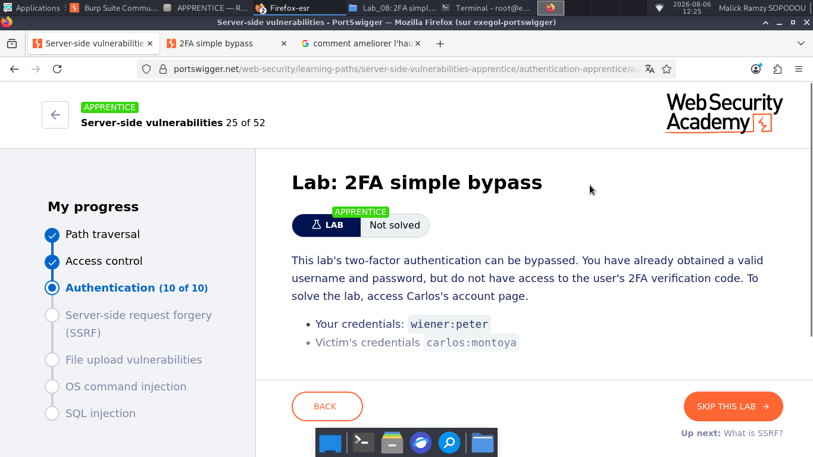
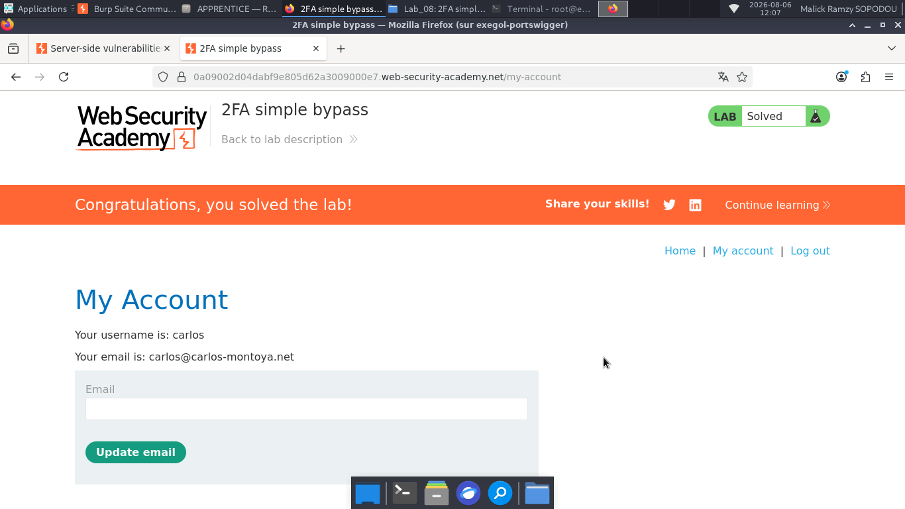

# Lab: 2FA simple bypass

> **CTF :** PORTSWIGGER  

> **Catégorie :** Authentication   

> **Difficulté :** APPRENTICE  

> **Points :**  ✅  

> **Date :** 27/07/2026  

> **Statut :** ✅ Résolu  

atut :**  ✅ Résolu   

---

## 📌 Description du Challenge

> *This lab's two-factor authentication can be bypassed. You have already obtained a valid username and password, but do not have access to the user's 2FA verification code. To solve the lab, access Carlos's account page.*

---

## 🎯 Objectif

pour résoudre ce niveau, il faut simplement se connecter en tant que Carlos, ensuite quitter la page au moment où on te demande le 2FA, et ensuite te reconnecter pour résoudre ce niveau.

---

## 🚩 Flag

---

## 🛡️ Remédiation.  
- Utiliser des applications d'authentification basées sur le temps (TOTP) plutôt que des codes numériques courts envoyés par e-mail ou SMS qui sont plus prédictibles.
---

## 💡 Points Clés à Retenir

- Le réflexe CTF : Connectez-vous avec votre propre compte, générez votre propre code MFA valide, mais modifiez la requête sortante en remplaçant votre nom d'utilisateur par celui de la cible. Si le serveur valide le code par rapport à votre session mais applique la connexion au nom de la cible, vous avez un contournement d'authentification.
---

## 📚 Références

- [PortSwigger — Lab: 2FA simple bypass](https://portswigger.net/web-security/topic)
- [OWASP — Vulnérabilité Associée](https://owasp.org/Top10/)

---

*Rédigé par : Malick Ramzy SOPODOU*  

*PORTSWIGGER🌍*
