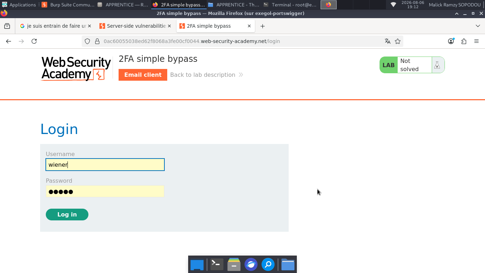
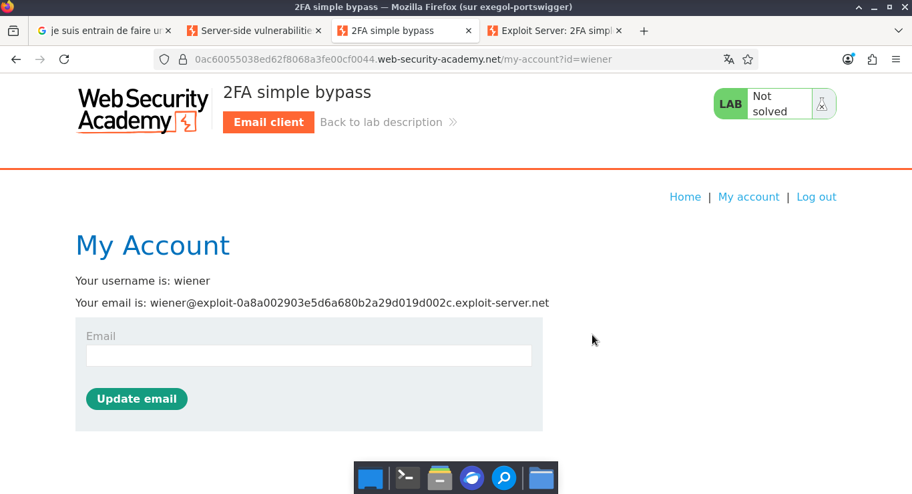
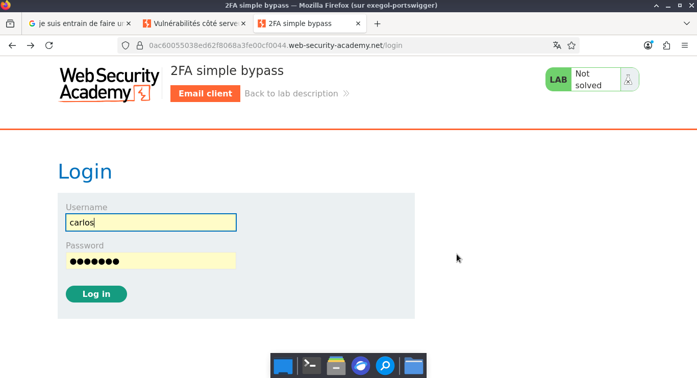
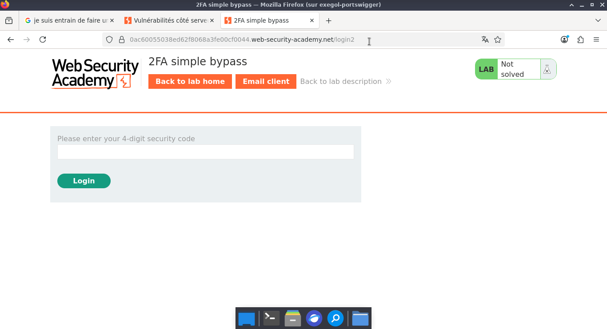
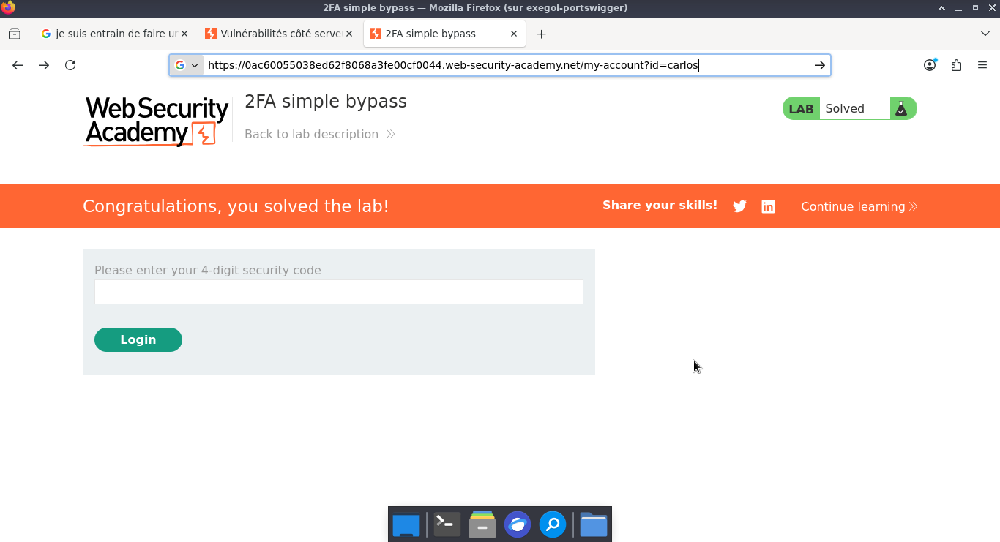

# Lab: 2FA simple bypass

> **CTF :** PORTSWIGGER  

> **Catégorie :** Authentication   

> **Difficulté :** APPRENTICE  

> **Points :**  ✅  

> **Date :** 27/07/2026  

> **Statut :** ✅ Résolu  

atut :**  ✅ Résolu   


---

## 📌 Description du Challenge

> *This lab's two-factor authentication can be bypassed. You have already obtained a valid username and password, but do not have access to the user's 2FA verification code. To solve the lab, access Carlos's account page.*

---

## 🎯 Objectif

pour résoudre ce niveau, il faut simplement se connecter en tant que Carlos, ensuite quitter la page au moment où on te demande le 2FA, et ensuite te reconnecter pour résoudre ce niveau.

---  

## 🔍 Reconnaissance  


- d'abord, connectons-nous à notre compte d'utilisateur et voyons comment réagit le site web
  

-  Allons dans l'onglet du client email pour y récupérer notre code 2FA et nous connecter.  
   


**Observations :**
- Nous constatons que l'application transmet le nom d'utilisateur sous forme de paramètre GET dans l'URL : /my-account?id=wiener

**Outils utilisés :**
- firefox

---

## 🧠 Hypothèse.  
Je suspecte une vulnérabilité de type contournement de l'authentification à deux facteurs.

---


### Étape 2 — 

 L'étape suivante consiste à se connecter au compte de Carlos en contournant l'authentification à deux facteurs (2FA). 






---

### Étape 3 — Modification de l'URL.  

- En modifiant le paramètre id dans l'URL (/my-account?id=carlos), nous essayons d'accéder directement au compte de Carlos. Cela permettrait de contourner l'authentification à deux facteurs, dont le code est envoyé sur une adresse email inaccessible.


**Payload utilisé :**
```

```


---


## 🚩 Flag


---

## 🛡️ Remédiation.  
Pour un développeur, la correction de cette faille de contrôle d'accès (IDOR) repose sur plusieurs principes fondamentaux :
1. Contrôle d'accès côté serveur (Broken Access Control) : 
   L'application ne doit jamais faire confiance aux paramètres modifiables par l'utilisateur (comme id=carlos dans l'URL) pour accorder l'accès à un compte. Le serveur doit systématiquement vérifier si l'utilisateur actuellement authentifié en session possède le droit d'accéder à cette ressource. 
2. Validation stricte du cycle de la 2FA :
   L'état de la session de l'utilisateur doit rester "non vérifié" tant que le code 2FA correct n'a pas été soumis. Le serveur doit bloquer l'accès à la page /my-account si l'étape de la double authentification a été sautée ou ignorée.  
3. Utilisation d'identifiants de session indirects :  
   Au lieu de passer le nom de l'utilisateur en clair dans l'URL, il est préférable d'utiliser des jetons de session (cookies HTTPOnly, JWT) chiffrés ou signés cryptographiquement, impossibles à deviner ou à modifier par l'attaquant.

---

## 💡 Points Clés à Retenir

1. Ne jamais suivre aveuglément le flux prévu : Un bon joueur de CTF teste toujours ce qui se passe lorsqu'on saute une étape (ex: passer directement de la page de login à la page finale en modifiant l'URL, sans valider la 2FA).
2. Se méfier des paramètres visibles : Dès qu'un paramètre sensible (identifiant, rôle, prix) est visible dans l'URL ou dans le corps d'une requête HTTP, il faut essayer de le modifier (Parameter Tampering).  
3. Comprendre la différence entre Authentification et Autorisation : Ce challenge illustre parfaitement que réussir à s'authentifier (première étape) ne signifie pas que l'application gère correctement les autorisations (le contrôle d'accès) aux pages internes.
---

## 📚 Références

- [PortSwigger — Lab: 2FA simple bypass](https://portswigger.net/web-security/topic)
- [OWASP — Vulnérabilité Associée](https://owasp.org/Top10/)


---

*Rédigé par : Malick Ramzy SOPODOU*  

*PORTSWIGGER🌍*
